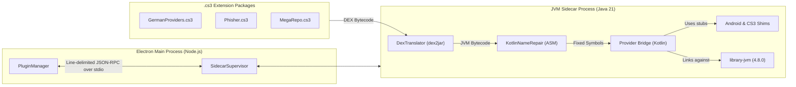
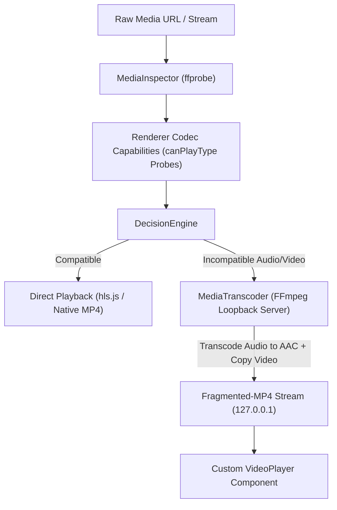

# CloudStream 3 Desktop

> **Windows-first desktop port of [CloudStream 3](https://github.com/recloudstream/cloudstream)** (Android, Kotlin 4.8.0), built with **Electron, React 19, TypeScript, Vite**, and an out-of-process **JVM Sidecar**.
>
> 🎯 **Core Mission:** Deliver the complete CloudStream experience on desktop while keeping the entire community extension ecosystem (`.cs3` plugin packages) working **drop-in, with zero modifications required from extension maintainers**.

---

## 📑 Table of Contents

- [1. What is CloudStream 3 Desktop?](#1-what-is-cloudstream-3-desktop)
- [2. The Core Innovation: Drop-in `.cs3` Extension Compatibility](#2-the-core-innovation-drop-in-cs3-extension-compatibility)
- [3. Key Features](#3-key-features)
- [4. High-Level Architecture](#4-high-level-architecture)
- [5. Getting Started (End Users)](#5-getting-started-end-users)
- [6. Developer Setup & Build Guide](#6-developer-setup--build-guide)
  - [Prerequisites](#prerequisites)
  - [Toolchain Setup](#toolchain-setup)
  - [Fresh Clone Build Sequence](#fresh-clone-build-sequence)
  - [Running the App in Development](#running-the-app-in-development)
  - [Running Tests](#running-tests)
  - [Packaging for Production](#packaging-for-production)
- [7. Repository Structure](#7-repository-structure)
- [8. Deep Dive: Subsystems & Technical Details](#8-deep-dive-subsystems--technical-details)
  - [The JVM Sidecar & Bytecode Translation](#the-jvm-sidecar--bytecode-translation)
  - [Universal Adaptive Media Playback Engine](#universal-adaptive-media-playback-engine)
  - [Push-Based Search & Discovery](#push-based-search--discovery)
  - [Lossless Android Backup Compatibility](#lossless-android-backup-compatibility)
  - [WebTorrent Streaming Engine](#webtorrent-streaming-engine)
  - [Download Manager (aria2c & yt-dlp)](#download-manager-aria2c--yt-dlp)
- [9. Troubleshooting & FAQ](#9-troubleshooting--faq)
- [10. Roadmap](#10-roadmap)
- [11. Contributing](#11-contributing)
- [12. License & Credits](#12-license--credits)

---

## 1. What is CloudStream 3 Desktop?

[CloudStream 3](https://github.com/recloudstream/cloudstream) is a popular open-source media streaming and tracking application for Android. It ships with **no built-in content**; instead, users install modular extensions distributed as `.cs3` files created by community developers.

**CloudStream 3 Desktop** brings this ecosystem to desktop computers. The governing design principle is:

$$\text{Android implementation defines expected product behavior} \longleftrightarrow \text{Electron implementation defines desktop delivery}$$

Rather than creating a walled garden or asking hundreds of plugin authors to rewrite their scrapers in JavaScript, this project runs Android `.cs3` extension packages directly on desktop operating systems.

---

## 2. The Core Innovation: Drop-in `.cs3` Extension Compatibility

Community `.cs3` files are ZIP archives containing **Android DEX bytecode** compiled against upstream's Kotlin provider APIs. Neither Chromium nor Node.js can execute Android bytecode.

CloudStream 3 Desktop solves this through an isolated JVM sidecar architecture:



1. **DEX $\rightarrow$ JVM Bytecode Translation:** `DexTranslator` uses `dex2jar 2.4.38` at plugin installation time to convert DEX into standard Java bytecode, cached by archive SHA-256 hash. Tested against 392 real plugins (18,217 classes, 6,617 Kotlin coroutine state machines) with **0 verification failures**.
2. **Bytecode Repair (`KotlinNameRepair`):** Automatically fixes Kotlin inline-value-class method symbols (where `dex2jar` rewrites Kotlin hyphens into underscores, causing `NoSuchMethodError` in `kotlin.Result`).
3. **Android & App Shims:** Handcrafted, lightweight shims for Android APIs used by providers (`android.content.Context`, `android.net.Uri`, `android.content.SharedPreferences`, `android.os.Handler`, `android.os.Looper`, `android.content.pm.PackageManager`, `androidx.appcompat.app.AppCompatActivity`, `androidx.fragment.app.DialogFragment`).
4. **CloudStream `:app` Type Emulation:** High-fidelity stubs for internal types (`Plugin`, `DataStore`, `CloudflareKiller`, `syncproviders` models).
5. **Process Sandboxing:** The JVM runs as an independent OS child process communicating strictly via line-delimited JSON-RPC over `stdio`. A plugin memory leak, infinite loop, or `System.exit` cannot crash the Electron desktop app.

---

## 3. Key Features

- 🔌 **100% Drop-in Extension Compatibility:** Add your favorite community repositories (`phisher`, `GermanProviders`, `cs-kraptor`, `MegaRepo`, `cinephile`, etc.) and run `.cs3` plugins immediately.
- ⚡ **Universal Adaptive Playback Engine:** Dynamic codec probing detects Chromium decoders. Incompatible audio (AC-3, E-AC-3, DTS) and video formats are automatically remuxed or transcoded to fragmented-MP4 in real time via FFmpeg over loopback HTTP.
- 🔍 **Push-Shaped Real-Time Search:** Search queries fan out concurrently to all enabled providers (up to 8 in flight) with immediate incremental UI streaming via IPC snapshots.
- 🎬 **Unified Home & Discovery Catalogs:** Rich metadata exploration powered by Stremio Cinemeta, TVmaze, and AniList with smart title enrichment.
- 🧲 **Integrated WebTorrent Engine:** In-app torrent streaming over loopback HTTP with sequential piece prioritization, leading-bytes readiness detection, and automatic single-file extraction for season packs.
- 📥 **Built-in Download Center:** Integrated batch downloading for episodes and series using high-speed portable `aria2c` and `yt-dlp` backends.
- 🔄 **Lossless Android Backup Portability:** Imports and exports CloudStream Android backup files using Android's native 6-bucket SharedPreferences key grammar (`_Bool`, `_Int`, `_String`, `_Float`, `_Long`, `_StringSet`).
- 💬 **Multi-Dub & Subtitle Support:** Real-time dub switching, on-demand embedded subtitle extraction (SubRip/ASS $\rightarrow$ WebVTT), and automated online subtitle matching via OpenSubtitles v3.
- 📊 **Provider Health & Analytics:** Automatic tracking of provider response times, success rates, failure classifications, and recommendations.

---

## 4. High-Level Architecture

```
┌──────────────────────────────────────────────────────────────────────────────────┐
│                           RENDERER PROCESS (React 19)                            │
│  Views: Home (Discovery) · Search · Detail · Library · Settings · Extensions     │
│  Components: VideoPlayer (Custom HLS/fMP4) · DownloadCenter · SearchScopePicker  │
└────────────────────────────────────────┬─────────────────────────────────────────┘
                                         │ typed contextBridge (electron/preload.ts)
                                         ▼
┌──────────────────────────────────────────────────────────────────────────────────┐
│                            MAIN PROCESS (Electron/Node)                          │
│                                                                                  │
│  ┌────────────────────────┐  ┌────────────────────────┐  ┌────────────────────┐  │
│  │ ContentService         │  │ PlaybackSession        │  │ DatastoreManager   │  │
│  │ (Search & Resolution)  │  │ (Adaptive Media Engine)│  │ (Android Schema)   │  │
│  └───────────┬────────────┘  └───────────┬────────────┘  └────────────────────┘  │
│              │                           │                                       │
│  ┌───────────▼────────────┐  ┌───────────▼────────────┐  ┌────────────────────┐  │
│  │ PluginManager          │  │ MediaTranscoder        │  │ TorrentEngine      │  │
│  │ & SidecarSupervisor    │  │ (FFmpeg / ffprobe)     │  │ (WebTorrent HTTP)  │  │
│  └───────────┬────────────┘  └────────────────────────┘  └────────────────────┘  │
└──────────────┼───────────────────────────────────────────────────────────────────┘
               │ JSON-RPC (stdio)
               ▼
┌──────────────────────────────────────────────────────────────────────────────────┐
│                            JVM SIDECAR (Java 21)                                 │
│  Main (JSON-RPC) ──► PluginHost ──► ProviderBridge (Kotlin) ──► Providers (.cs3) │
│  Runtime Classpath: library-jvm-4.8.0.jar + 56 transitive dependencies + Shims   │
└──────────────────────────────────────────────────────────────────────────────────┘
```

---

## 5. Getting Started (End Users)

### Requirements
- **OS:** Windows 10 or Windows 11 (64-bit). *(macOS and Linux support planned)*
- **Java:** Included out-of-the-box in packaged releases. *(For dev runs: Java 21+ is required)*

### Basic Usage Flow
1. **Download & Launch:** Run the packaged installer or portable executable from the [Releases](https://github.com/dipenparmar12/cs3/releases) section.
2. **Add Extension Repositories:**
   - Navigate to **Extensions** in the sidebar.
   - Switch to the **Repositories** tab.
   - Click **Add Repository** and enter a valid CloudStream repository URL (e.g. from the community repo list), or enable the bundled starter repositories.
3. **Install Extensions:**
   - Switch to the **Extensions** tab, browse available plugins, and click **Install**.
   - The app will download the `.cs3` archive, translate the bytecode, and register the providers.
4. **Discover & Watch:**
   - Use the **Home** tab to browse popular movies, anime, and series.
   - Use the **Search** tab to search across all enabled providers simultaneously.
   - Open any title, choose your preferred stream/dub/quality, and click **Play**.
5. **Migrate from Android:**
   - Go to **Settings $\rightarrow$ Backup & Restore**.
   - Click **Import Android Backup** and select your `.json` backup file from CloudStream Android. All bookmarks, watch history, and resume positions will load immediately.

---

## 6. Developer Setup & Build Guide

### Prerequisites

| Tool | Minimum Version | Notes |
|---|---|---|
| **Node.js** | `22.x` or newer | Node 22+ enables native `--experimental-strip-types` for fast tests |
| **Bun** | `1.1.x` or newer | Recommended package manager (`bun install`, `bun run dev`) |
| **Java JDK** | `21` (Temurin/OpenJDK) | Compiled to bytecode class version 65. Java 17 is **not** supported |
| **Apache Maven** | `3.9.x` | Required to build sidecar and Kotlin bridge |
| **Git** | Any modern version | |

> [!NOTE]
> Git submodules under `repositories/` and `_cloudstream_ref_android/` are intentionally empty in a fresh clone. You do **not** need to initialize them to build or run the desktop app.

---

### Toolchain Setup

If you do not have Java 21 or Maven 3.9 configured globally on your system PATH, you can run the checked-in automated toolchain fetcher from the repository root:

```bash
node tools/fetch_toolchain.mjs
```

This downloads and unpacks OpenJDK 21 and Maven 3.9 into `tools/toolchain/`. The application's `SidecarSupervisor` and build scripts automatically detect and prioritize this directory.

---

### Fresh Clone Build Sequence

When setting up the project for the first time, build the three JVM runtime components **in the exact order shown below**:

```bash
# 1. Install Node/Electron dependencies
cd cs3_windows
bun install
cd ..

# 2. Build the JVM sidecar and Android API shims
mvn -f sidecar/pom.xml package
# -> Produces sidecar/target/cs3-sidecar.jar and sidecar/runtime/cs3-sidecar-android-shim.jar

# 3. Resolve upstream CloudStream library-jvm dependencies
mvn -f sidecar/runtime-deps/pom.xml package
# -> Downloads library-jvm-4.8.0.jar + 55 transitive dependencies into sidecar/runtime/

# 4. Compile the Kotlin provider bridge
mvn -f sidecar/bridge/pom.xml package
# -> Produces sidecar/runtime/cs3-provider-bridge.jar
```

---

### Running the App in Development

```bash
cd cs3_windows
bun run dev
```

This starts the Vite dev server on port `5173` with HMR (Hot Module Replacement) and launches the Electron application with automatic main/preload rebuilds on file change.

To check TypeScript types across the entire project:
```bash
cd cs3_windows
bun run typecheck   # Runs 'tsc -b' across app and electron configs
```

---

### Running Tests

```bash
# 1. JVM Sidecar Unit Tests (20 tests: translation, linkage, shims)
mvn -f sidecar/pom.xml test

# 2. Main Process, Media Decision, Source Cache & Native Engine Tests (99 tests)
# The native-engine suite spawns a real mpv; the pipeline suite runs real ffmpeg.
# Both skip themselves when the binary is absent.
cd cs3_windows
bun run test:electron

# 3. Real-world Provider End-to-End Test Harness
# Tests real download, DEX translation, link scraping, and 2MB range stream from live hosts
node tools/e2e/provider-e2e.mjs --repo phisher --plugins 3

# 4. Vendor Coverage Matrix — can we actually play what the providers return?
# Probes every resolved link with the shipping inspector, runs the shipping decision
# engine over it, then plays each stream for real in mpv for a few seconds.
node --experimental-strip-types tools/e2e/native-engine-matrix.mjs --plugins 12
```

---

### Packaging for Production

To create a standalone Windows installer and portable binary:

```bash
# 1. Assemble and bundle the jlinked JRE and sidecar runtime into sidecar/dist/
node tools/package/build-runtime.mjs --verify

# 2. Build and package the Electron app
cd cs3_windows
bun run electron:build
```

The output installer and portable `.exe` will be generated in `cs3_windows/release/`.

---

## 7. Repository Structure

```
cs3/
├── cs3_windows/               # The Electron + React 19 Desktop Application
│   ├── electron/              # Electron Main Process services & IPC handlers
│   │   ├── main.ts            # App lifecycle, window management, IPC registration
│   │   ├── preload.ts         # Secure typed IPC bridge (CloudStreamElectronAPI)
│   │   ├── contentService.ts  # Master orchestrator for search, providers, and torrents
│   │   ├── playbackSession.ts # Active playback session management and source switching
│   │   ├── media/             # MediaInspector, DecisionEngine, PlaybackEngine
│   │   ├── cs3/               # JVM SidecarSupervisor, PluginManager, TitleEnricher
│   │   ├── torrent/           # WebTorrent engine, Indexers, Ranker, ReleaseParser
│   │   └── datastore.ts       # Android-compatible JSON persistence engine
│   ├── src/                   # React 19 Frontend (Vite)
│   │   ├── views/             # Home, Search, Detail, Library, Settings, History
│   │   ├── components/        # VideoPlayer, Extensions, SearchScope, DownloadCenter
│   │   ├── types/             # Shared TypeScript data models
│   │   └── App.tsx            # Main shell, routing, global notifications
│   ├── package.json           # Dependencies and build scripts
│   └── vite.config.ts         # Vite + vite-plugin-electron build config
│
├── sidecar/                   # JVM Process executing Android .cs3 extensions
│   ├── src/main/java/         # DexTranslator, LinkageAnalyzer, Android API stubs
│   ├── bridge/                # Kotlin Provider Bridge (MainAPI & ExtractorApi caller)
│   ├── runtime-deps/          # Maven POM resolving library-jvm 4.8.0 & transitives
│   ├── runtime/               # 56 runtime dependency jars (placed here after build)
│   └── pom.xml                # Sidecar build configuration
│
├── tools/                     # Build tools, test harnesses, and packaging scripts
│   ├── e2e/                   # Live provider test harnesses (provider-e2e.mjs)
│   ├── package/               # build-runtime.mjs (JRE jlink and sidecar packager)
│   ├── dex-spike/             # Translation benchmark harness (392 extensions)
│   └── fetch_toolchain.mjs    # Automated JDK 21 and Maven toolchain downloader
│
├── docs/                      # Architectural specifications & PRDs
│   ├── PRD/                   # 38 detailed Product Requirement & Architecture Docs
│   └── docs_cs3/              # Deconstructed Android CloudStream 3 architecture docs
│
└── AGENTS.md                  # Comprehensive engineering context & contributor rules
```

---

## 8. Deep Dive: Subsystems & Technical Details

### The JVM Sidecar & Bytecode Translation

- **Isolation Model:** Plugins run inside an external JVM process. If a provider throws an unhandled exception or enters an infinite loop, `SidecarSupervisor` times out the RPC request without disrupting UI or playback.
- **Runtime Classpath Provisioning:** At app startup, `RuntimeProvisioner` verifies that the active runtime files in `%APPDATA%/<app>/cs3-runtime/` match the expected fingerprint in `runtime-stamp.json`. If stale, files are updated atomically.
- **The Kotlin Bridge:** Located in `sidecar/bridge/`. Compiled against `library-jvm-4.8.0`. It acts as the reflection bridge between JSON-RPC stdio commands and the instantiated Kotlin `MainAPI` providers.

---

### Universal Adaptive Media Playback Engine

Chromium's native `<video>` element natively rejects common audio codecs like **AC-3, E-AC-3, and DTS**, and has inconsistent hardware HEVC support across GPU chipsets.



- **Audio Track Selection & Downmixing:** Automatically handles multi-audio releases. Incompatible 5.1/7.1 surround streams are downmixed to 2-channel stereo AAC to prevent center-channel voice dropouts on desktop speakers.
- **DASH & HLS Handling:** Live remuxing lets non-standard segment extensions (e.g. obfuscated `.png` TS segments) play seamlessly. Note that `-allowed_extensions ALL` alone stopped being sufficient in FFmpeg 7.1, which added `-extension_picky` and defaults it *on*; the flag is detected per binary because an older ffmpeg rejects the whole command line.
- **Native Engine (mpv) for what Chromium will never decode:** 4K/8K HEVC, 10-bit, HDR, VC-1, MPEG-2, DTS-HD and TrueHD are handed to a bundled mpv, which decodes them on the GPU (`d3d11va` / NVDEC / Vulkan / VideoToolbox) untouched — no re-encode, no downscale, no HDR loss, and the original channel layout preserved. Routing is a decision made from measured metadata, not a mode: by default mpv takes only what the in-app player would have re-encoded or downmixed. Measured across 26 providers, that is 17 of every 30 probeable streams.
- **On-Demand Subtitle Extraction:** SubRip (`.srt`) and ASS tracks embedded in remote MKV containers are extracted on demand and converted to WebVTT (`<track>` standard).

---

### Push-Based Search & Discovery

Unlike legacy synchronous search interfaces that wait for the slowest scraper, CS3 Desktop uses push-based streaming:
- `search:start` initiates the session and returns an initial plan snapshot.
- Queries fan out asynchronously to enabled providers (capped at 8 in flight).
- As each provider finishes, `search:update` events push new results into the UI in real time.
- Users can click and watch results from fast providers immediately while slower providers continue in the background.

---

### Lossless Android Backup Compatibility

`datastore.ts` faithfully preserves CloudStream Android's 6-bucket SharedPreferences key serialization format:
- `_Bool`, `_Int`, `_String`, `_Float`, `_Long`, `_StringSet`
- Keys are mapped directly to and from `cs3_datastore.json` in `userData`.
- Android `.json` backups can be imported and exported cleanly without loss of watch progress, bookmarks, or custom settings.

---

### WebTorrent Streaming Engine

- Powered by `webtorrent` with an embedded loopback HTTP streaming server.
- **Leading-Bytes Readiness:** Calculates playback readiness based on the availability of the file header and sequential starting chunks rather than overall torrent download percentage.
- **Season Pack Isolation:** When playing an episode from a multi-file series torrent, non-relevant files are automatically deselected to focus 100% of swarm bandwidth on the active video file.

---

### Download Manager (aria2c & yt-dlp)

- Multi-connection accelerated downloads powered by portable `aria2c` instances managed over JSON-RPC.
- Video extractor downloads powered by portable `yt-dlp`.
- Automatic retry, pause/resume, and batch queue management for full seasons.

---

## 9. Troubleshooting & FAQ

<details>
<summary><b>Q: I get "JVM sidecar failed to start" or "Java 21 required".</b></summary>

The sidecar requires Java 21 or newer (class file format 65). If your system `JAVA_HOME` points to Java 17 or older:
1. Run `node tools/fetch_toolchain.mjs` to automatically install JDK 21 into `tools/toolchain/`, OR
2. Install [Adoptium Temurin JDK 21](https://adoptium.net/temurin/releases/?version=21) and set your `JAVA_HOME` environment variable accordingly.
</details>

<details>
<summary><b>Q: A provider fails with 403 Forbidden or Bot Protection.</b></summary>

Some third-party video hosts employ Cloudflare Turnstile, DDoS-Guard, or bot-protection captchas. CloudStream Android solves these using an Android WebView challenge solver. The desktop counterpart (an off-screen Chromium WebView challenge bridge) is currently in development (see [Roadmap](#10-roadmap)).
</details>

<details>
<summary><b>Q: How do I enable Adult (NSFW) extensions?</b></summary>

By default, adult content is gated for safety. Go to **Settings $\rightarrow$ Content & Sources** and toggle **Enable Adult Content**. Once enabled, NSFW provider tags will appear in the Extensions manager.
</details>

<details>
<summary><b>Q: Why are the `repositories/` submodules empty after cloning?</b></summary>

This is intentional. The submodules under `repositories/` represent an archival corpus of 26 community repositories used for translation benchmarking. You do not need them to run or develop the application; repositories are added dynamically at runtime via URL.
</details>

---

## 10. Roadmap

- [x] Full DEX $\rightarrow$ JVM translation and bytecode repair pipeline.
- [x] Kotlin provider bridge execution with `library-jvm-4.8.0`.
- [x] Multi-source concurrent push search and instant streaming.
- [x] Adaptive FFmpeg audio/video transcode loopback engine.
- [x] WebTorrent sequential streaming and download center.
- [x] Lossless Android backup import/export.
- [ ] **Off-screen Chromium WebView Bridge** for automated Cloudflare / DDoS-Guard challenge resolution.
- [ ] **Cross-Platform Packaging:** macOS (ARM64 / x64 DMG) and Linux (AppImage / Flatpak).
- [ ] **Cloud Sync:** Two-way synchronization with AniList, MyAnimeList, and Simkl accounts.

---

## 11. Contributing

Contributions are warmly welcomed! Please follow these guidelines:

1. **Check Issues & PRDs:** Review existing issues and relevant documents in `docs/PRD/` before submitting large architectural changes.
2. **Preserve Drop-in Compatibility:** Never introduce changes that require community `.cs3` plugins to be modified.
3. **Typecheck & Test:** Ensure all checks pass before submitting a pull request:
   ```bash
   # From cs3_windows/
   bun run typecheck
   bun run test:electron
   mvn -f ../sidecar/pom.xml test
   ```
4. **Honest Reporting:** When a provider or link is unavailable, display a descriptive reason rather than synthetic placeholder content.

---

## 12. License & Credits

- **License:** Upstream CloudStream 3 is licensed under **[GPL-3.0](https://www.gnu.org/licenses/gpl-3.0.html)**. CloudStream 3 Desktop is released under the same license.
- **Upstream Project:** [CloudStream 3 Android](https://github.com/recloudstream/cloudstream) by Lagradost and the CloudStream contributors.
- **Key Open Source Libraries:** [dex2jar](https://github.com/pxb1988/dex2jar), [Electron](https://www.electronjs.org/), [React](https://react.dev/), [Vite](https://vitejs.dev/), [FFmpeg](https://ffmpeg.org/), [WebTorrent](https://webtorrent.io/), and [aria2](https://aria2.github.io/).
