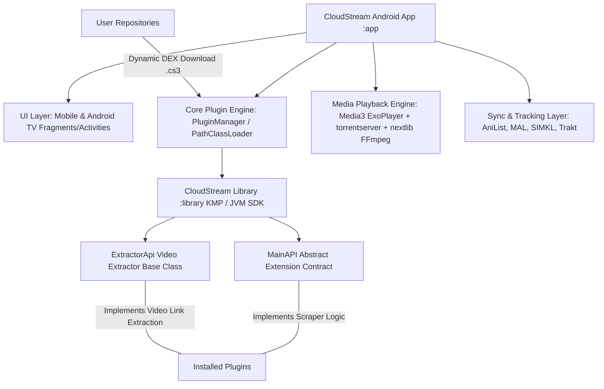

# 01. Executive Summary & Core Purpose

## 1. What is CloudStream?

**CloudStream** (specifically `CloudStream 3`) is an open-source, modular, highly customisable, multi-platform media application for Android devices (Phones, Tablets, Android TV, Google TV, and Amazon FireStick).

At its core, CloudStream acts as a **decoupled media center framework** and **multimedia playback engine**. It provides a unified, ad-free, high-performance interface for searching, tracking, streaming, and downloading online media content.

---

## 2. What Problem Does It Solve?

In the current media ecosystem, users face several major pain points:

1. **Fragmented User Experience**: Content is scattered across dozens of different websites, services, and platforms, each with distinct user interfaces, playback engines, and ad networks.
2. **Aggressive Advertising & Malware**: Streaming media sites are frequently infested with intrusive pop-up ads, redirect scripts, crypto-miners, and malicious trackers.
3. **Lack of Cross-Platform TV/Mobile Parity**: Most mobile video applications perform poorly on Android TV / Fire TV devices because they rely heavily on touch controls and lack Leanback/DPAD navigation support.
4. **Legal & Centralization Risks**: Monolithic streaming apps that bake video scrapers directly into the client code frequently suffer from DMCA take-downs, domain bans, and single-point-of-failure shutdowns.
5. **Lack of Progress & Watchlist Synchronization**: Users who watch media across multiple platforms struggle to sync their progress with tracking platforms like MyAnimeList, AniList, Trakt, or SIMKL.

---

## 3. How CloudStream Solves These Problems

CloudStream solves these challenges through a clean, decoupled architecture:

### A. Zero Bundled Video Sources (Decoupled Plugin Architecture)
* CloudStream contains **no built-in media scrapers, pirated content, or host links**.
* The core application is purely an engine: a video player, UI shell, tracker sync client, and plugin container.
* Users load functionality dynamically by installing **Extensions/Plugins** hosted on third-party user repositories.
* If a specific provider goes offline or changes its site structure, only that plugin needs an update—the main CloudStream app remains fully functional and intact.

### B. Ad-Free, Privacy-First Architecture
* All network requests are routed through custom HTTP clients (`NiceHttp`, `Jsoup`, `Ksoup`).
* JavaScript pop-ups, telemetry scripts, ad banners, and trackware are stripped out at the network/scraping level.
* No user telemetry or tracking metrics are collected by the app.

### C. Unified Phone & TV Interface (Leanback + Mobile)
* Built from the ground up to support both **Touch UI** (phones/tablets) and **DPAD / Remote Control UI** (Android TV / FireStick / Shield TV).
* Supports Android TV EPG (Electronic Program Guide) and "Watch Next" launcher channels.

### D. Multi-Provider Media Tracking Integration
* Automatically syncs watch status, episode progress, ratings, and recommendations with:
  * **AniList** (GraphQL)
  * **MyAnimeList (MAL)** (OAuth2 REST API)
  * **SIMKL** (REST API for TV, Anime, Movies)
  * **Trakt.tv** (REST API)
  * **Kitsu** (REST API)

### E. Torrent Streaming & Advanced Media Playback Engine
* Includes an integrated BitTorrent streaming engine (`torrentserver`), enabling direct streaming of torrent magnets without downloading the complete file first.
* Features native Media3 (ExoPlayer) playback, FFmpeg hardware/software audio decoding for DTS/AC3/EAC3, custom subtitle formatting, subtitle auto-search (OpenSubtitles, Subdl, Addic7ed), preview seekbars, and Chromecast casting.

---

## 4. Key Target Platforms & System Requirements

| Target Platform | Min SDK | Target SDK | Primary Interface |
|---|---|---|---|
| Android Mobile & Tablets | API 23 (Android 6.0 Marshmallow) | API 36 (Android 15) | Touch / Gesture UI |
| Android TV / Google TV | API 23 (Android 6.0 Marshmallow) | API 36 (Android 15) | DPAD Remote / Leanback UI |
| Fire OS (Amazon FireStick/FireTV) | API 23 (Fire OS 6+) | API 36 | DPAD Remote UI |

---

## 5. Architectural High-Level Diagram

