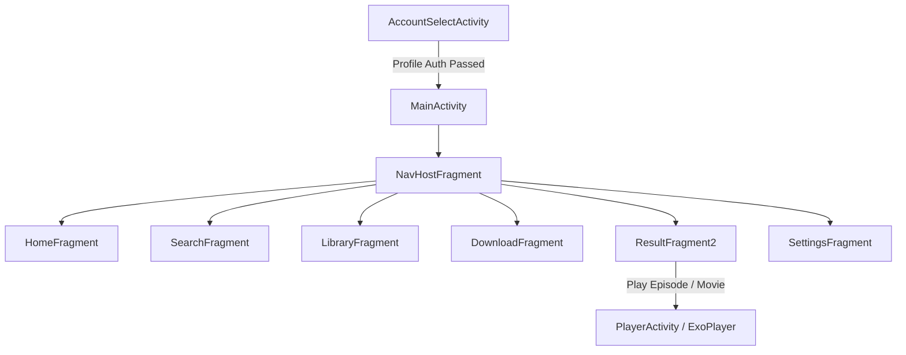

# 04. UI & Presentation Layer Architecture

## 1. Overview & UI Design Philosophy

CloudStream uses a **Single Activity Architecture** anchored by `MainActivity.kt` and `AccountSelectActivity.kt`, backed by Android Jetpack Navigation Component, Fragments, and ViewBinding.

The presentation layer is engineered to be **bi-functional**: it dynamically adapts its layout, navigation paradigm, and focus handling depending on whether it is running on a **Touch Device (Phone/Tablet)** or a **Television Device (Android TV, FireStick, Shield TV)**.

---

## 2. Navigation Architecture (`nav_graph.xml`)

The application's view hierarchy is managed via Jetpack Navigation (`androidx.navigation`). `MainActivity` hosts a `NavHostFragment` that swaps between core application screens:

---

## 3. Phone vs Android TV Dual-Mode UI (`UIHelper.kt`)

CloudStream detects TV environments at runtime by checking `UiModeManager` or system features (`FEATURE_LEANBACK` / `FEATURE_TELEVISION`).

| Feature | Phone / Tablet Mode | Android TV / Leanback Mode |
|---|---|---|
| Navigation Bar | Bottom Navigation Bar (`BottomNavigationView`) | Side Navigation Drawer (`NavigationRail` / Leanback Menu) |
| Focus Traversal | Touch / Swipe gestures | DPAD Remote Navigation (`isFocusable = true`, `nextFocusDown`, `nextFocusUp`) |
| Image Posters | High-density grids | Horizontal scrolling Leanback rows with scale-on-focus animations |
| Search Input | On-screen virtual keyboard | Voice Search integration & DPAD-optimized grid keyboard |
| Channel Sync | N/A | Android TV EPG & "Watch Next" launcher integration (`TvChannelUtils.kt`) |

---

## 4. Key UI Fragments & Components

### A. `AccountSelectActivity.kt`
* Initial launcher activity.
* Supports multi-user profile switching.
* Enforces security features:
  * **Biometric Authentication**: Fingerprint prompt (`BiometricAuthenticator.kt`).
  * **PIN Code Auth**: 4-digit PIN verification overlay for locked profiles.
  * **TV QR Code Auth**: Displays a generated QR code (`qrcode-kotlin`) for quick login from mobile devices.

### B. `HomeFragment.kt` & `HomeViewModel.kt`
* Displays home rows supplied by installed plugins that have `hasMainPage = true`.
* Supports dynamic filtering by content type (Movies, Series, Anime, Live TV) and provider.
* Features auto-scrolling hero banners and preview cards.

### C. `ResultFragment2.kt` & `ResultViewModel2.kt`
* Comprehensive detail view for media titles (Movies, TV Shows, Anime).
* Displays posters, backdrop banners, cast lists, trailers (powered by `NewPipeExtractor`), season/episode dropdowns, and download buttons.
* Integrates **Anime-DB Filler Check** (`FillerEpisodeCheck.kt`): Highlights filler anime episodes with distinct visual badges.
* Shows real-time synchronization status with external tracking services (AniList, MAL, SIMKL, Trakt).

### D. `LibraryFragment.kt`
* Organizes user's saved titles into customizable list categories:
  * *Watching*, *Completed*, *On Hold*, *Dropped*, *Plan to Watch*, *Re-watching*.
* Supports drag-and-drop reordering, custom tags, sorting (by title, score, updated date), and backup/restore.

### E. `SettingsFragment.kt` Sub-System
Structured into clean, modular sub-preference screens:
* **General Settings**: Language selections, app updates, UI layout preferences.
* **Player Settings**: Subtitle styles, default audio languages, buffer size, hardware acceleration, skip intra/outro lengths.
* **Provider Settings**: Preferred provider filters, language filtering, repository links.
* **Extensions Settings**: Installed plugin management, repository installer, extension status monitor.
* **Network Settings**: DNS-over-HTTPS (DoH) providers (Cloudflare, Google, AdGuard), custom user-agent strings, proxy settings.
* **Backup & Restore**: Full JSON/ZIP archive export and import.
