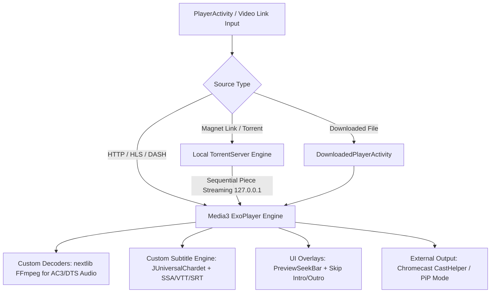

# 05. Playback Media & Torrent Engine Architecture

## 1. Overview of the Media Engine

The playback engine in CloudStream is built to handle streaming media from diverse protocols (HLS, DASH, MP4, MKV, BitTorrent Magnets, IPTV M3U8) with full support for hardware acceleration, software audio decoding, custom subtitles, picture-in-picture, and Chromecast.

The central playback controller is implemented in `PlayerActivity.kt` and `DownloadedPlayerActivity.kt`, utilizing AndroidX Media3 ExoPlayer.

---

## 2. Media3 ExoPlayer & Native Decoders

### A. Core ExoPlayer Stack (`libs.versions.toml`)
CloudStream uses the latest AndroidX Media3 suite:
* `media3-exoplayer`: Core player implementation.
* `media3-exoplayer-hls`: HTTP Live Streaming protocol handler.
* `media3-exoplayer-dash`: Dynamic Adaptive Streaming over HTTP handler.
* `media3-ui`: Native media controls and player view layouts.
* `media3-cast`: Google Cast integration.

### B. Software Audio Decoding via `nextlib` (FFmpeg)
Standard Android TV boxes and budget phones often lack hardware decoding licenses for DTS, DTS-HD, AC3, EAC3, and TrueHD audio streams.

To solve this, CloudStream bundles **`nextlib-media3ext`** and **`nextlib-mediainfo`**, providing precompiled native C++ FFmpeg audio extension libraries. When ExoPlayer encounters an unsupported audio codec, it gracefully falls back to `nextlib` software decoding.

---

## 3. Integrated BitTorrent Streaming Engine (`torrentserver`)

CloudStream features an embedded BitTorrent client library (`com.github.recloudstream:torrentserver`).

### How BitTorrent Streaming Works:
1. When a user selects a `magnet:` link or `.torrent` file, `PlayerActivity` starts the background `torrentserver`.
2. `torrentserver` parses the torrent metadata and starts downloading pieces in **sequential mode** (prioritizing header and initial video blocks).
3. `torrentserver` hosts a local HTTP server at `http://127.0.0.1:<port>/stream`.
4. ExoPlayer is fed the local `127.0.0.1` HTTP URL, treating the torrent stream as a standard web stream with full seek functionality.

---

## 4. Subtitle Sub-System & Customization

CloudStream contains a custom-built subtitle parser and rendering pipeline:

* **Supported Formats**: SubRip (`.srt`), WebVTT (`.vtt`), SubStation Alpha (`.ass` / `.ssa`).
* **Encoding Detection**: Uses `juniversalchardet` to automatically detect text encodings (UTF-8, Windows-1252, GBK, EUC-KR, ISO-8859-1) for international subtitles.
* **Online Subtitle Auto-Search**: If a video lacks embedded subtitles, CloudStream queries online subtitle APIs (`OpenSubtitlesApi`, `Subdl`, `Addic7ed`, `SubSource`) based on title and episode numbers.
* **Custom Styling (`colorpicker`)**: Users can customize subtitle text size, font family, text color, outline color/width, background opacity, shadow offset, and vertical position on screen.
* **Time Alignment Sync**: Includes a real-time offset slider to shift subtitle timing forward or backward by millisecond increments.

---

## 5. Playback Controls & Utility Features

| Feature | Implementation File | Description |
|---|---|---|
| **Video Skip (Intro/Outro)** | `utils/videoskip/` | Manual button overlays and automatic auto-skip intervals for anime/series intros and credits. |
| **SeekBar Preview** | `previewseekbar-media3` | Shows thumbnail previews while scrubbing along the timeline bar. |
| **Chromecast** | `CastHelper.kt` / `CastOptionsProvider.kt` | Casts video streams directly to Chromecast devices with full remote playback control. |
| **Picture-in-Picture (PiP)** | `PlayerActivity.kt` | Automatically enters PiP mode when the app is minimized during video playback. |
| **Aspect Ratio Switcher** | `PlayerActivity.kt` | Toggle between Fit, Crop, Stretch, 16:9, 4:3, and Zoom modes. |
| **Playback Speed & Pitch** | `PlayerActivity.kt` | Adjust speed from 0.25x to 3.0x with optional pitch correction. |
