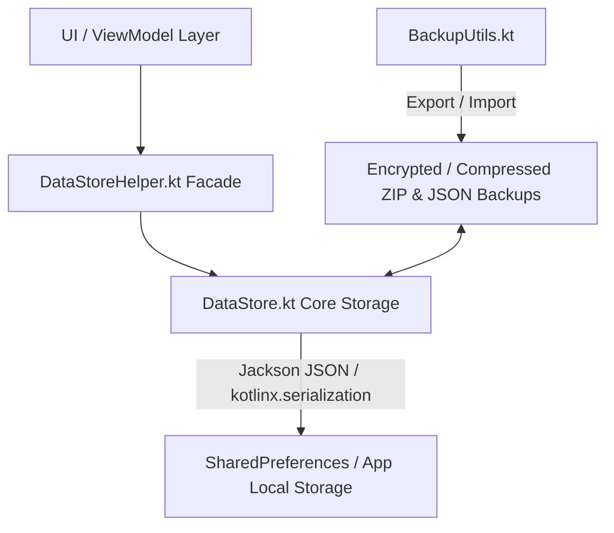

# 06. Trackers, Sync & Data Persistence Architecture

## 1. Local Data Persistence Layer

CloudStream uses a lightweight, fast, key-value storage engine built on top of Android `SharedPreferences` and Jackson Kotlin JSON serialization (`DataStore.kt` & `DataStoreHelper.kt`).

### Key Data Persistence Components:
1. **`DataStore.kt`**: Low-level generic wrapper around Android `SharedPreferences`. Serializes and deserializes arbitrary Kotlin data classes to JSON strings using Jackson / `kotlinx.serialization`.
2. **`DataStoreHelper.kt`**: High-level helper methods for managing user bookmarks (`BookmarkedData`), watch history, episode playback resume timestamps, user profile settings, installed plugin states, and repository URLs.
3. **`SafeFile.kt`**: A utility layer that abstracts storage file handling across scoped storage API boundaries (Android 10+), preventing URI permissions issues when reading/writing downloads or plugin `.cs3` files.

---

## 2. Multi-Profile Account System

CloudStream supports **Multi-User Profiles** managed by `AccountManager.kt` and `AccountSelectActivity.kt`:
* Each profile has isolated watch histories, bookmarks, preferences, and tracker authentication tokens.
* Profiles can be protected with individual PIN codes or fingerprint biometric authentication (`BiometricAuthenticator.kt`).

---

## 3. Media Tracking & Metadata Integrations

CloudStream integrates with major global media tracking services to automatically scrobble watched episodes, synchronize watchlists, and display rating metadata.

All sync providers inherit from `AuthAPI` or `SyncAPI` located in `app/src/main/java/com/lagradost/cloudstream3/syncproviders/`.

| Tracking Service | Provider File | Protocol / Auth Method | Capabilities |
|---|---|---|---|
| **AniList** | `AniListApi.kt` | GraphQL API + OAuth2 | Anime watchlist sync, episode scrobbling, ratings, custom lists, recommendations. |
| **MyAnimeList (MAL)** | `MALApi.kt` | REST API + OAuth2 | MAL anime watchlist sync, episode status updates, score syncing. |
| **SIMKL** | `SimklApi.kt` | REST API + Client ID/Secret | Anime, TV Series, and Movies tracking, auto-scrobble, watch next sync. |
| **Trakt.tv** | `TraktApi.kt` | REST API + OAuth2 | Movies and TV show scrobbling, watch status sync, history logging. |
| **Kitsu** | `KitsuApi.kt` | REST API | Kitsu anime tracking and progress updates. |
| **Anime-DB** | `FillerEpisodeCheck.kt` | Bundled Library (`anime-db`) | Offline/online database query to flag anime filler episodes with visual UI tags. |

---

## 4. Backup & Restore Sub-System (`BackupUtils.kt`)

CloudStream provides a comprehensive backup and restore facility:

* **Export Format**: Standard JSON files or compressed `.zip` archives.
* **Included Data**:
  * User profiles and account credentials (excluding plain-text passwords).
  * Full watch history and resume timestamps.
  * Bookmarks and custom list categories.
  * App settings, UI theme choices, and player preferences.
  * Installed extension repository URLs and plugin data lists.
* **Import Pipeline**: `BackupUtils.restorePrompt()` validates input files, migrates legacy schemas, and reloads `DataStore` and `PluginManager` without requiring app restart.
