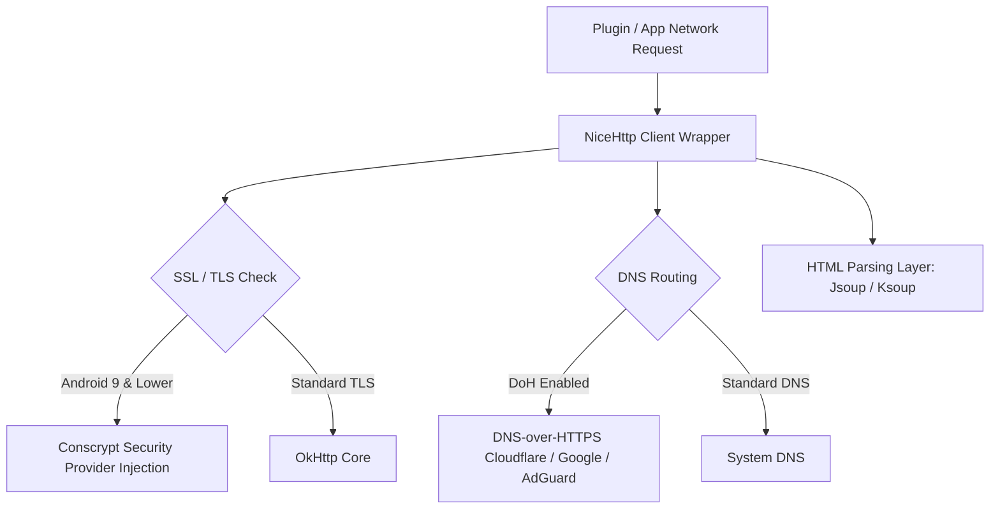

# 07. Security, Network Services & Utility Architecture

## 1. Network Stack & HTTP Layer

CloudStream's networking pipeline is optimized for privacy, anti-censorship, and resilient web scraping.

### Essential Network Components:
1. **`NiceHttp` (`com.github.Blatzar:NiceHttp`)**:
   * A Kotlin-first wrapper over OkHttp that simplifies GET/POST requests, cookie persistence, custom headers, and session management for extension scrapers.
2. **`Conscrypt` Integration (`org.conscrypt:conscrypt-android`)**:
   * On older Android versions (Android 9 and below), system TLS/SSL certificates often fail due to outdated root CA stores.
   * CloudStream explicitly bundles Conscrypt TLS provider to fix SSL handshake crashes (`SSLHandshakeException`).
3. **DNS-over-HTTPS (DoH)**:
   * To bypass ISP-level DNS domain blocking of streaming mirrors, CloudStream integrates native DoH support into OkHttp, allowing users to route DNS queries via Cloudflare (`1.1.1.1`), Google (`8.8.8.8`), or AdGuard.
4. **HTML Parsing Layer**:
   * Utilizes **Jsoup** (JVM) and **Ksoup** (Kotlin Multiplatform) to execute high-speed DOM querying and CSS selector extraction against raw provider web pages.

---

## 2. In-App Updater System (`InAppUpdater.kt` & `PackageInstaller.kt`)

CloudStream operates outside the Google Play Store and provides an automated in-app update framework:

* **Release Checking**: `InAppUpdater.kt` queries the official GitHub Releases API for the target repository (stable or prerelease channel).
* **APK Download**: When a new release is detected, `InAppUpdater` downloads the release APK file to the app's cache directory.
* **Installation Execution**:
  * Uses `PackageInstallerService` and `PackageInstaller.kt`.
  * On supported Android versions (Android 12+), uses `UPDATE_PACKAGES_WITHOUT_USER_ACTION` permission to install updates seamlessly without disrupting the user.

---

## 3. Background Services & Download Engine

CloudStream features a resilient, background-capable file download engine:

| Service Name | Type | Purpose |
|---|---|---|
| `VideoDownloadService.kt` | Foreground Service (`dataSync`) | Manages high-speed background video downloads with persistent ongoing notifications. |
| `DownloadQueueService.kt` | Foreground Service (`dataSync`) | Manages serial execution of queued episode downloads. |
| `VideoDownloadRestartReceiver.kt` | Broadcast Receiver | Auto-restarts interrupted downloads when device connectivity is restored. |

### Download Features:
* **HTTP Range Requests**: Supports chunked multi-threaded HTTP downloading with resume capabilities.
* **HLS Stream Downloading**: Converts HLS `.m3u8` playlists into single contiguous `.mp4` video files directly on device disk.
* **Storage Provider Abstraction**: Writes download files using `SafeFile.kt`, ensuring compliance with Android Scoped Storage rules.

---

## 4. App Security & Power Management

* **Biometric Authentication (`BiometricAuthenticator.kt`)**: Enforces device fingerprint / face unlock authentication before granting access to locked profiles or settings.
* **Wake Lock & Battery Optimizations (`PowerManagerAPI.kt`)**: Utilizes `REQUEST_IGNORE_BATTERY_OPTIMIZATIONS` and `PARTIAL_WAKE_LOCK` to ensure video downloading and torrent streaming are not killed by device OS power managers when the screen is off.
