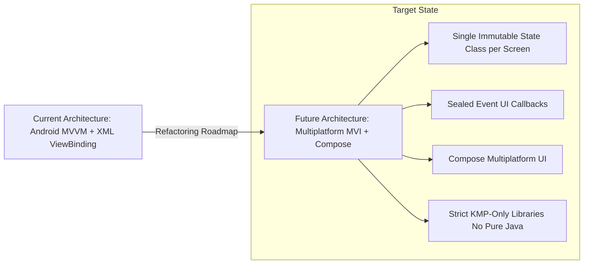

# 09. CI/CD, DevOps & Future Architectural Roadmap

## 1. Overview

To achieve 100% complete coverage of the CloudStream repository, this document covers the build pipelines, CI/CD automation, internationalization (i18n), repository policies, and the official future architectural migration roadmap to Jetpack Compose and Kotlin Multiplatform (KMP).

---

## 2. CI/CD Automation & GitHub Workflows (`.github/workflows/`)

CloudStream uses GitHub Actions to automate build, testing, localization, documentation, and pre-release distribution:

| Workflow File | Trigger / Schedule | Purpose & Actions Performed |
|---|---|---|
| [`prerelease.yml`](file:///D:/dipen/cs3/cloudstream_ref_android/.github/workflows/prerelease.yml) | Push to `master` / Nightly | Compiles `prerelease` APK flavor, signs it using keystore secrets, extracts short git commit hash, and creates an automated GitHub Pre-release. |
| [`build_to_archive.yml`](file:///D:/dipen/cs3/cloudstream_ref_android/.github/workflows/build_to_archive.yml) | Tag creation / Release | Builds production release APK and App Bundle (`.aab`), stripped of dependency metadata. |
| [`update_locales.yml`](file:///D:/dipen/cs3/cloudstream_ref_android/.github/workflows/update_locales.yml) | Scheduled / Webhook | Runs `.github/locales.py` to pull updated translation strings from Hosted Weblate and commit updated `strings.xml` resources. |
| [`generate_dokka.yml`](file:///D:/dipen/cs3/cloudstream_ref_android/.github/workflows/generate_dokka.yml) | Release / Dispatch | Runs Dokka documentation engine on `:app` and `:library` modules to output HTML API reference docs. |
| [`instrumented-tests.yml`](file:///D:/dipen/cs3/cloudstream_ref_android/.github/workflows/instrumented-tests.yml) | Pull Request | Runs automated Android UI and unit test suites on Android emulators. |
| [`pull_request.yml`](file:///D:/dipen/cs3/cloudstream_ref_android/.github/workflows/pull_request.yml) | PR submission | Validates Kotlin code style, linting rules, and compilation checks. |

---

## 3. Translation & Internationalization (i18n)

* **Platform**: Hosted Weblate (`hosted.weblate.org/engage/cloudstream`).
* **Automation**: `.github/locales.py` parses Weblate translation files and synchronizes Android XML string resources (`app/src/main/res/values-*/strings.xml`) across 40+ supported languages.

---

## 4. Repository Policies & Guidelines

* **AI Usage Policy ([`AI-POLICY.md`](file:///D:/dipen/cs3/cloudstream_ref_android/AI-POLICY.md))**:
  1. Contributors must explicitly disclose any AI tools used in Pull Requests or issues.
  2. All AI-generated code must be thoroughly tested before submitting PRs.
  3. Strict code reviews reject low-effort automated submissions.
* **Fastlane Publishing ([`fastlane/`](file:///D:/dipen/cs3/cloudstream_ref_android/fastlane))**: Contains localized metadata, store listings, and changelogs for automated distribution.

---

## 5. Future Architectural Roadmap ([`COMPOSE.md`](file:///D:/dipen/cs3/cloudstream_ref_android/COMPOSE.md))

CloudStream is actively transitioning toward a modern, cross-platform architecture:

### 1. Shift from MVVM to MVI (Model-View-Intent)
* Current MVVM exposes multiple separate `LiveData` fields per ViewModel, creating UI synchronization friction.
* The new **MVI** paradigm enforces:
  * A single **immutable State class** representing the complete UI state.
  * A single **Sealed Event class** capturing all UI intents.
  * Complete UI reproducibility and event replaying.

### 2. Full Kotlin Multiplatform (KMP) & Compose Transition
* Eliminates pure Java dependencies in favor of KMP-compatible libraries (`kotlinx-coroutines`, `kotlinx-datetime`, `ksoup`, `ktor`).
* Prepares CloudStream to compile its UI shell via **Compose Multiplatform** for Android, Desktop JVM (Windows/Linux/macOS), Web (Wasm), and iOS targets.
