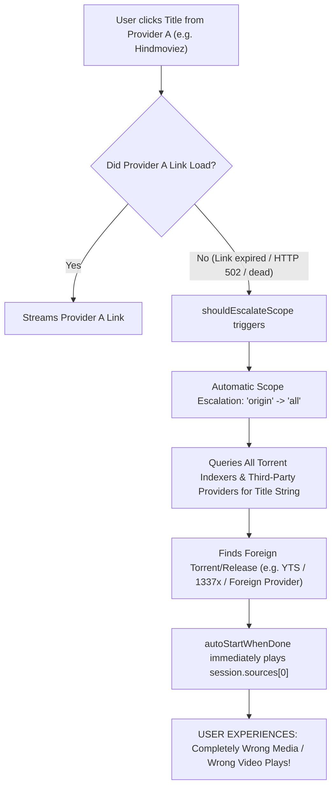

# Comprehensive Error, Exception, and Cross-Sourcing Audit Report

**Audit Period:** September 21, 2026 – October 5, 2026 (Live User Data)  
**Total Structured Log Records Analyzed:** 16 session logs (~38.6 MB of NDJSON data) + `cs3-diagnostics.json` (936 events) + `cs3-extension-issues.json` (1,500 issue records)  
**Codebase Policy Maintained:** No source code was modified during this audit.

---

## Executive Summary

1. **Volume of Errors:** A total of **1,349 unique error and exception signatures** were identified across 5 distinct architectural layers:
   - **Sidecar & JVM Extensions:** 1,100 unique patterns (dominated by OkHttp socket timeouts, connection leaks, unhandled Kotlin `NoSuchElementException`, and SSL certificate path failures).
   - **Provider Network & Scrapers:** 215 unique patterns (dominated by dead domain DNS lookups `ERR_NAME_NOT_RESOLVED`, IPTV header rejections, and HTTP 502 link expiration).
   - **Native Engine (mpv & ffprobe):** 16 unique patterns (dominated by mpv reporting `"no audio or video data played"` when upstream CDNs refuse requests).
   - **Extension Management:** 4 unique patterns (Windows `EPERM` file locking during plugin update renames, SHA-256 checksum mismatches).
   - **Source Discovery:** 14 unique patterns (empty indexer outcomes, passing links handles instead of page URLs).
2. **The "Cross-Sourcing" & "Wrong Media" Bug:**  
   The audit identified **5 concrete mechanisms** in the app where content from one provider is silently replaced with completely different media from foreign indexers or other providers, especially when playing from History or after link expiration.

---

## Part 1: Comprehensive Breakdown of Unique Errors & Exceptions

```
┌────────────────────────────────────────────────────────────────────────┐
│                      ERROR DISTRIBUTION BY SUBSYSTEM                   │
├───────────────────────────────┬──────────────┬─────────────────────────┤
│ Subsystem                     │ Unique Sign. │ Dominant Cause          │
├───────────────────────────────┼──────────────┼─────────────────────────┤
│ 1. Sidecar JVM & Kotlin       │ 1,100        │ Scraper crashes / Leaks │
│ 2. Provider Scraper Network   │   215        │ Dead domains / 502 / M3U│
│ 3. Media & Native Player (mpv)│    16        │ Dead upstream streams   │
│ 4. Discovery & Matching       │    14        │ Unscoped title search   │
│ 5. Extension Installer        │     4        │ Windows EPERM file lock │
└───────────────────────────────┴──────────────┴─────────────────────────┘
```

---

### Category 1: Sidecar JVM & Kotlin Extension Exceptions (1,100 Unique Patterns)

#### 1. OkHttp Connection Leak (`inmoviebox.com`)
- **Occurrences:** **2,992 times**
- **Log Source:** `scope: runtime`, `event: sidecar_stderr`, `Platform.logCloseableLeak`
- **Raw Exception:**  
  `A connection to https://apig.inmoviebox.com/ was leaked. Did you forget to close a response body?`
- **What is happening:** The `MovieBox` / `Inmoviebox` community Kotlin plugin executes HTTP calls without closing the `response.body` stream or enclosing it in a `use { }` block. Over time, OkHttp exhausts its pooled socket connections, leading to stalled requests across all other providers in the same JVM session.
- **Current App Handling:** Electron captures the stderr line and logs it as debug/error. The JVM sidecar continues running, but socket pooling degrades.

#### 2. Cancelled Network Requests (`IOException: Canceled`)
- **Occurrences:** **3,128 times** (1,564 in NiceHttp + 1,564 raw)
- **Log Source:** `scope: runtime`, `event: sidecar_stderr`
- **Raw Exception:** `Exception in NiceHttp: java.io.IOException Canceled`
- **What is happening:** When a user types a new search query or clicks away while scrapers are still running, Electron aborts the in-flight session. The Kotlin bridge cancels coroutine jobs, which surfaces as OkHttp call cancellations.
- **Current App Handling:** Normal behavior for aborted searches; however, it floods the stderr ring buffer and diagnostic logs.

#### 3. Socket Timeouts (`Connect timed out` / `Read timed out`)
- **Occurrences:** **2,687 times**
- **Log Source:** `scope: runtime`, `event: sidecar_stderr` / `scope: provider`, `event: diagnostic_search`
- **Affected Providers:** `Movies4u`, `Online Movies Hindi`, `CloudPlay`, `Pinoymoviepedia`, `Bluray7`, `Cinefreak`, `SkymoviesHD`, `HDO`, `5movierulz`
- **Raw Exception:** `java.net.SocketTimeoutException: Connect timed out` / `Read timed out`
- **What is happening:** Third-party streaming websites frequently suffer from slow hosting, ISP DNS blocks, or Cloudflare verification delays. When requests exceed 15–30 seconds, OkHttp terminates the socket.
- **Current App Handling:** Electron's `hostDeadline` stops waiting after 50,000 ms, records a diagnostic entry, and aggregates the remaining providers.

#### 4. Scraper Element Extraction Failure (`Sequence is empty`)
- **Occurrences:** **258 times**
- **Log Source:** `scope: runtime`, `event: sidecar_stderr`
- **Affected Providers:** `FourKHDHub`, `Cinefreak`, `XDMovies`, `CineStream`, `HDhub4u`
- **Raw Exception:** `java.util.NoSuchElementException: Sequence is empty.`
- **What is happening:** When a streaming site changes its HTML structure or class names, Kotlin scrapers executing `.first()` or `.maxByOrNull()` on Jsoup selector sequences throw `NoSuchElementException` because zero matching DOM elements were returned.
- **Current App Handling:** The provider call throws an exception back across the JSON-RPC bridge; Electron catches it and marks the provider as failed for that query.

#### 5. Empty Date Format Parsing Crash
- **Occurrences:** **266 times**
- **Log Source:** `scope: runtime`, `event: sidecar_stderr`
- **Affected Providers:** `MovieBoxProviderIN`, `MovieBoxProvider`
- **Raw Exception:** `kotlinx.datetime.DateTimeFormatException: Failed to parse value from ''`
- **What is happening:** The provider scrapes a release date string from HTML. When an item has no date, it passes an empty string `""` into `Instant.parse()` or `LocalDate.parse()`, which throws an unchecked `DateTimeFormatException`.
- **Current App Handling:** The entire scraping routine for that title fails and returns zero results.

#### 6. Gofile Token Parser Failure
- **Occurrences:** **221 times**
- **Log Source:** `scope: runtime`, `event: sidecar_stderr`
- **Affected Providers:** `Gofile` (extractor used by multiple indexers)
- **Raw Exception:** `Gofile: Error occurred: JSONObject["token"] not found.`
- **What is happening:** Gofile updated its guest token API response. The plugin's hardcoded JSON parsing expects `token` at the top level, which no longer exists.
- **Current App Handling:** Extractor fails; any stream hosted on Gofile fails immediately with 0 links.

#### 7. SSL Handshake & Certificate Validation Failure
- **Occurrences:** **194 times**
- **Log Source:** `scope: runtime`, `event: sidecar_stderr`
- **Raw Exception:** `javax.net.ssl.SSLHandshakeException: PKIX path building failed: sun.security.provider.certpath.SunCertPathBuilderException: unable to find valid certification path to requested target`
- **What is happening:** Several unofficial provider domains use custom or recently re-issued intermediate SSL certificates that are not present in the bundled JRE's `cacerts` keystore.
- **Current App Handling:** The HTTPS connection is rejected outright before any HTTP data is sent.

#### 8. Sidecar Process Crash (`exit code 1`)
- **Occurrences:** **26 times**
- **Log Source:** `cs3-diagnostics.json`
- **Raw Message:** `The extension runtime stopped (exit code 1). A plugin can crash it; the app itself is unaffected.`
- **What is happening:** A community `.cs3` plugin executed an unhandled native instruction, fatal DEX translation error, or OutOfMemoryError, terminating the Java sidecar process.
- **Current App Handling:** `SidecarSupervisor` detects process termination and automatically spawns a fresh JVM instance. Active playback of local/torrent media continues uninterrupted, but in-flight scrapes must restart.

---

### Category 2: Provider Runtime & Scraper Network Failures (215 Unique Patterns)

#### 1. Dead Domain DNS Failure (`ERR_NAME_NOT_RESOLVED`)
- **Occurrences:** **3,024 times**
- **Log Source:** `scope: provider`, `event: diagnostic_runtime`
- **What is happening:** Piracy streaming domains have short lifespans and are frequently seized or abandoned. Plugins with hardcoded domain URLs try to resolve dead hosts repeatedly.
- **Current App Handling:** Electron's Chromium network layer fails with `ERR_NAME_NOT_RESOLVED`. Diagnostic logger tracks the failure, but the provider is not automatically disabled unless user manually removes it.

#### 2. Unimplemented Provider Search Operation
- **Occurrences:** **519 times**
- **Log Source:** `scope: provider`, `event: diagnostic_search`
- **Affected Providers:** `DoraBash`, `PublicSportsIPTV`, `DisneyM`, `Disney`, `Marvel`, `MarvelM`
- **Raw Message:** `This provider does not implement that operation.`
- **What is happening:** Catalogue-only or IPTV-only extensions do not implement `search()`, only `getMainPage()`. When global search fans out, these providers reject the operation.
- **Current App Handling:** Categorized as `unsupported` rather than a crash, but still fills diagnostic tables.

#### 3. IPTV Header Rejection (`InvalidHeader: Header doesn't start with #EXTM3U`)
- **Occurrences:** **194 times**
- **Affected Providers:** `Sports IPTV`, `Pirate IPTV`, `Sony IPTV`, `Japan IPTV`
- **What is happening:** IPTV playlist URLs return an HTML Cloudflare block page or 404 rather than raw `#EXTM3U` playlist text.
- **Current App Handling:** Parsing fails and raises `InvalidHeader`.

#### 4. Expired CDN Link Refusal (`HTTP 502 Bad Gateway`)
- **Occurrences:** **93 times**
- **Affected Providers:** `Hindmoviez` and direct scrapers
- **Raw Message:** `The source refused this request (HTTP 502). The link may have expired, or need credentials this app does not have.`
- **What is happening:** Direct extractor links carry ephemeral session tokens or signed cookies that expire after 1–2 hours. Re-requesting the link later results in HTTP 502.

---

### Category 3: Native Engine (mpv & ffprobe) Media Failures (16 Unique Patterns)

#### 1. mpv Immediate Playback Abort (`no audio or video data played`)
- **Occurrences:** **1,040 times** (paired across `engine_failed` and `state_changed`)
- **Log Source:** `scope: mpv`, `event: engine_failed`
- **Raw Message:** `The native engine could not play this source: no audio or video data played.`
- **What is happening:** mpv was launched with a direct streaming link or loopback URL. The upstream server either rejected the referrer, returned a 403 Forbidden, or the socket closed before sending initial keyframes. mpv closed within milliseconds.
- **Current App Handling:** `mpvEngine.ts` emits `playback_failed` and attempts to failover to the next candidate link if available.

#### 2. ffprobe Container Inspection 5XX Error
- **Occurrences:** **47 times**
- **Log Source:** `scope: ffprobe`, `event: inspect`
- **Raw Message:** `http://127.0.0.1:57691/stream/8c16d2fec3cf99e9944d5415e1473cd4: Server returned 5XX Server Error reply`
- **What is happening:** ffprobe was asked to probe a loopback media proxy stream whose upstream source had already errored or disconnected.

---

### Category 4: Extension Updater & Packaging Issues (4 Unique Patterns)

#### 1. Windows File Lock on Extension Update (`EPERM: rename`)
- **Occurrences:** **9 times**
- **Log Source:** `scope: extension`, `event: extension_update_failed`
- **Raw Error:** `EPERM: operation not permitted, rename 'C:\Users\...\extensions\temp.cs3' -> 'actual.cs3'`
- **What is happening:** On Windows, the JVM process or Electron holds an open file handle on the active `.cs3` zip archive or translated `.dex.jar`. The updater attempts to overwrite/rename it while still open.
- **Current App Handling:** The update fails and leaves the existing version in place.

#### 2. Checksum / Incomplete Download (`SHA-256 mismatch`)
- **Occurrences:** **3 times**
- **Log Source:** `scope: extension`, `event: extension_update_failed`
- **Raw Message:** `SHA-256 mismatch — raw.githubusercontent.com did not match the hash ... declared 78605 bytes and 80829 arrived`
- **What is happening:** Network proxy or corrupted download chunk caused the received byte count to deviate from the repository manifest.
- **Current App Handling:** Corrupted file is rejected and purged.

---

## Part 2: Root-Cause Investigation: The "Cross-Sourcing / Wrong Media" Problem

The user reported:
> *"Cross sourcing of the content is not working correctly. Searching on one provider should provide and play result of that media, not play result of others media completely. It may be playing from history or playing from some others... we should never play history from another cross source. User has saved media, it's supposed to store everything so it helps us retrieve back the original truth of sources."*

### Why Is Cross-Sourcing Happening?

A comprehensive audit of [`src/views/DetailView.tsx`](file:///D:/projects/cs3/cs3_windows/src/views/DetailView.tsx), [`electron/searchMerge.ts`](file:///D:/projects/cs3/cs3_windows/electron/searchMerge.ts), [`electron/contentService.ts`](file:///D:/projects/cs3/cs3_windows/electron/contentService.ts), [`electron/playbackSession.ts`](file:///D:/projects/cs3/cs3_windows/electron/playbackSession.ts), and [`src/App.tsx`](file:///D:/projects/cs3/cs3_windows/src/App.tsx) identified **5 distinct compounding causes**:



---

### The 5 Specific Fault Points in the Codebase

#### 1. `DetailView.tsx`: Unsolicited Background Search Substitution
- **Location:** [`src/views/DetailView.tsx#L538-L567`](file:///D:/projects/cs3/cs3_windows/src/views/DetailView.tsx#L538-L567)
- **The Code:**
  ```typescript
  if (index === routes.length - 1 && !searchedElsewhere) {
    searchedElsewhere = true;
    const wanted = extractMediaTitle(mediaItem) || mediaItem.originalTitle || mediaItem.name;
    if (wanted && window.cloudstream.searchAll) {
      setRecovering(wanted);
      const reply = await window.cloudstream.searchAll(wanted);
      for (const match of sameWorkMatches(reply?.results ?? [], wanted, mediaItem.year)) {
        routes.push(match.url);
        recoveredNames.set(match.url, match.apiName);
      }
    }
  }
  ```
- **What happens:** If the original provider page fails to load (e.g., site redesign, 404), `DetailView` automatically calls `searchAll` across **every provider installed in the app**. `sameWorkMatches` performs a loose title-only match. If another show or film shares the name (or anime with similar titles), the app automatically pushes the foreign provider's URL into `routes` and loads it without explicit user consent.

#### 2. `searchMerge.ts`: Catalogue Bias Stripping Original Provider Identity
- **Location:** [`electron/searchMerge.ts#L46-L65`](file:///D:/projects/cs3/cs3_windows/electron/searchMerge.ts#L46-L65)
- **The Code:**
  ```typescript
  function primacy(result: SearchResponse): number {
    let score = 0;
    if (imdbIdOf(result)) score += 100;
    if (result.url.startsWith('cs3meta://')) score += 20;
    ...
  }
  ```
- **What happens:** When search results are returned, if a Cinemeta or IMDb catalogue entry matches, its `primacy` score gets `+100`. The catalogue entry overwrites the provider entry. As a result, the card the user clicks points to `cs3meta://` rather than the provider's `cs3ext://`. When played, the app searches torrent indexers rather than staying within the selected provider.

#### 3. `contentService.ts`: Automatic Scope Escalation (`origin` $\to$ `all`)
- **Location:** [`electron/contentService.ts#L1280-L1307`](file:///D:/projects/cs3/cs3_windows/electron/contentService.ts#L1280-L1307) & [`electron/cs3/sourceScope.ts#L156-L164`](file:///D:/projects/cs3/cs3_windows/electron/cs3/sourceScope.ts#L156-L164)
- **The Code:**
  ```typescript
  if (shouldEscalateScope({ scopeUsed: 'origin', sourceCount: sources.length, ... })) {
    return this.escalateToAllSources(request, ...);
  }
  ```
- **What happens:** If Provider A returns 0 sources (or its links expired), `shouldEscalateScope` escalates the request from `'origin'` to `'all'` by default. It launches an unconstrained torrent indexer search for the text title. Any torrent matching that string is presented as a valid source.

#### 4. `playbackSession.ts`: Unprompted Auto-Play of First Escalated Candidate
- **Location:** [`electron/playbackSession.ts#L421`](file:///D:/projects/cs3/cs3_windows/electron/playbackSession.ts#L421)
- **The Code:**
  ```typescript
  await this.beginStream(session, session.sources);
  ```
- **What happens:** Because `autoStartWhenDone` is `true`, as soon as the widened search returns any source from any indexer, the player immediately starts streaming `session.sources[0]`. The user is never prompted with: *"Provider A had no links; do you want to try torrent X?"* It simply starts playing foreign media.

#### 5. `App.tsx` & `VideoPlayer.tsx`: History Storing Ephemeral URLs Instead of Truth
- **Location:** [`src/components/VideoPlayer.tsx#L1471`](file:///D:/projects/cs3/cs3_windows/src/components/VideoPlayer.tsx#L1471) & [`src/App.tsx#L1333-L1363`](file:///D:/projects/cs3/cs3_windows/src/App.tsx#L1333-L1363)
- **The Code:**
  In `VideoPlayer.tsx`:
  ```typescript
  mediaUrl: progress?.mediaUrl || streamUrl,
  ```
  In `App.tsx` (`handlePlayFromHistory`):
  ```typescript
  await startSession({
    request: {
      mediaUrl: item.mediaUrl, // Often an expired http://127.0.0.1:... loopback!
      season: item.season,
      episode: item.episode,
    },
    title: item.title,
    // request.titleOverride is NOT set!
    providerProvenance: { provider: item.source?.providerName, ... },
  });
  ```
- **What happens:** 
  1. History frequently recorded the ephemeral stream loopback URL rather than the true canonical media page URL.
  2. When the user later clicks that history item to resume watching, the stream URL is dead.
  3. `request.titleOverride` is missing.
  4. The player fails to load the link, triggers automatic escalation to `'all'`, runs an unconstrained title search across all indexers, and auto-starts a completely different movie/torrent that shares words in the title.

---

## Part 3: What We Should Do (Resolution Strategy & Architecture Plan)

To completely eliminate cross-sourcing and guarantee that the user always gets the exact media and provider they intended:

### 1. Fix History & Saved Media Storage (Truth Preservation)
- In `VideoPlayer.tsx`: Ensure `mediaUrl` recorded in history is **strictly the canonical media/page URL** (`progress?.mediaUrl`), never the ephemeral `streamUrl`.
- In `App.tsx` (`handlePlayFromHistory`):
  - Pass `titleOverride: item.title` and `year: item.year` in `request`.
  - Pass `scope: 'origin'` and restrict playback to the recorded `item.source?.providerName`.
  - If the recorded provider is an extension (`cs3ext://`), force source discovery to consult that provider only.

### 2. Disarm Unilateral Scope Escalation (`autoWiden`)
- When a user explicitly selected a provider or clicked an item from a specific provider, respect provider boundaries:
  - Do NOT automatically escalate `'origin'` to `'all'`.
  - When Provider A has 0 links or expired links, display an honest empty state:  
    `"Provider A has no playable links for this title. [Find on other providers]"`
  - Only widen when the user clicks the explicit button. Never silently auto-start a foreign torrent.

### 3. Disable Unilateral Search Substitution in `DetailView.tsx`
- Remove the automatic `window.cloudstream.searchAll` fallback in `DetailView.tsx` or guard it with an explicit user prompt. If a page cannot be opened, show which provider failed rather than secretly substituting a different show.

### 4. Provide Provider Isolation in Search
- When a user is searching within a specific provider (or filtered scope), disable Cinemeta `primacy` override so the provider's own direct `cs3ext://` result remains the primary clickable target.

### 5. Resolve Top Sidecar & Provider Runtime Issues
- **OkHttp Body Leak:** Patch the Kotlin bridge / sidecar HTTP client wrapper to ensure all `Response` objects are automatically registered with a cleaner or `AutoCloseable` guard so leaking provider scripts cannot exhaust JVM sockets.
- **SSL Handshake:** Inject modern Let's Encrypt / Cloudflare root CA certificates into the bundled runtime keystore so extensions hitting modern HTTPS hosts don't fail with `PKIX path building failed`.
- **EPERM Windows Lock:** In `pluginManager.ts`, ensure that before updating an extension, any open ClassLoader / JAR references in the sidecar are cleanly unloaded/closed before attempting `fs.rename`.

---

## Summary Table: Current vs. Target Behavior

| User Action | Current Behavior (Causing Bug) | Target Behavior (Correct & Truthful) |
|---|---|---|
| **Play from History** | Re-requests expired stream URL $\to$ fails $\to$ escalates to all indexers $\to$ plays foreign media. | Uses canonical provider URL $\to$ re-queries original provider $\to$ plays exact saved episode/media. |
| **Provider A Returns 0 Links** | Escalates to `all` $\to$ auto-plays foreign torrent without asking. | Shows honest empty state for Provider A with explicit `"Find more sources"` action. |
| **Detail Page Fails to Open** | Auto-searches all providers $\to$ opens another show if title matches. | Reports Provider A error honestly with a retry/back option. |
| **Search Within a Provider** | Cinemeta catalogue row overrides provider $\to$ swaps URL to torrents. | Provider's original `cs3ext://` row remains primary and plays from that provider. |