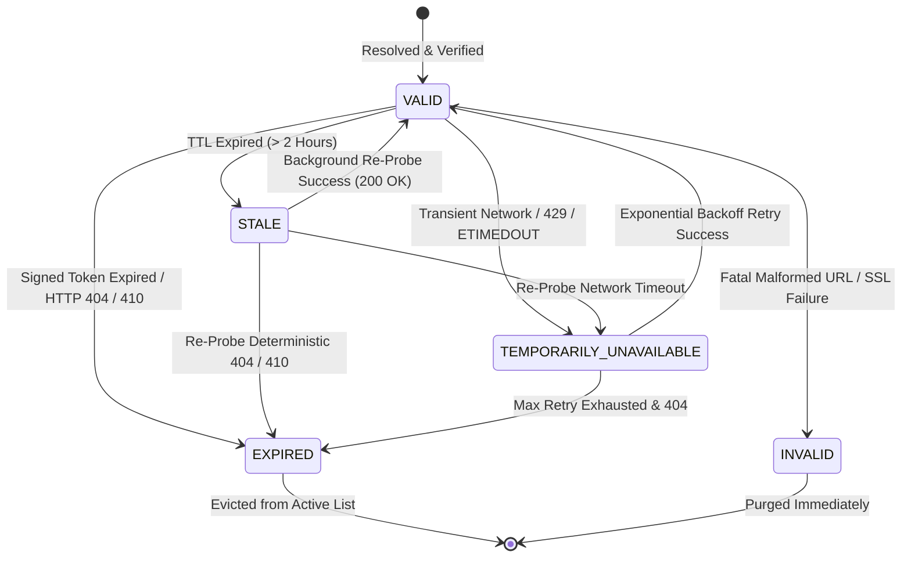
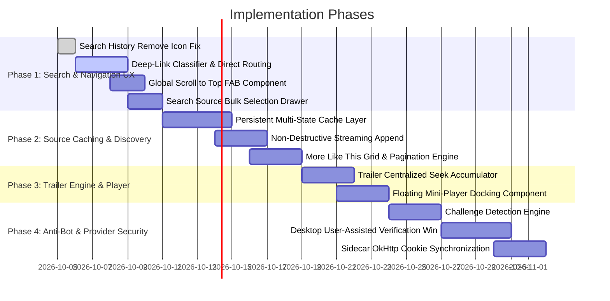

# PRD-55: Media Sources, Discovery, Navigation, Search UX, Trailer Playback, and Provider Verification Improvements

**Status:** Proposed  
**Scope:** Windows desktop application (`cs3_windows`), Sidecar JVM Runtime, IPC Subsystems, UI/UX Components  
**Priority:** High  
**Document Generation Date:** October 2026  
**Related Documents:** 
- `docs/PRD/37-universal-media-compatibility-and-adaptive-playback-engine.md`
- `docs/PRD/40.1-playback-reliability-observability-and-routing-baseline.md`
- `docs/PRD/42-resume-continuity-and-seekable-sources.md`
- `docs/PRD/49-security-anti-bot-challenge-and-session-interception.md`
- `docs/PRD/51-push-search-multi-profile-scope-and-aggregation-engine.md`
- `docs/PRD/52-incognito-mode-private-streaming.md`
- `docs/2026-10-05-errors_need_to_resolve.md`

---

## 1. Executive Summary & Purpose

### 1.1 Product Intent
CloudStream 3 Desktop is designed as a high-performance, Windows-first media aggregator combining native JavaScript/TypeScript scrapers, Android `.cs3` extensions executing within an out-of-process JVM sidecar, BitTorrent/DHT streaming engines, external media extractors (`yt-dlp`), and Cinemeta/Stremio metadata aggregators.

While core media playback and extension execution are operational, intensive real-world testing (documented across 16 NDJSON session logs and 1,349 distinct error signatures in `docs/2026-10-05-errors_need_to_resolve.md`) has exposed significant operational friction in source discovery, navigation, media recommendations, search ergonomics, trailer handling, and scraper security challenges.

This Product Requirements Document (PRD) defines the architectural specifications, lifecycle state machines, data models, IPC protocols, and UI/UX behaviors required to address 12 core areas:

1. **Persistent and Intelligent Media-Source Caching**: Eliminate destructive re-fetching when opening the "Select a Source" dialog, implementing a resilient multi-state caching layer (`VALID`, `STALE`, `TEMPORARILY_UNAVAILABLE`, `EXPIRED`, `INVALID`).
2. **Incremental Source Discovery and Non-Destructive Refresh**: Deliver instantaneous sub-10ms initial dialog renders from cache while safely streaming background provider discoveries without wiping or shifting the user's active viewport.
3. **"More Like This" Pagination and Infinite Scrolling**: Transition the limited fixed horizontal carousel into a dedicated, paginated multi-column grid with dynamic pre-fetching, deduplication, and scroll restoration.
4. **Global "Scroll to Top" Floating Control**: Implement a universal, context-aware floating action button (FAB) that dynamically binds to the active scrollable container across all views (Home, Discover, Search, Detail, Library, Settings).
5. **Shareable Deep-Link Smart Detection and Direct Routing**: Classify URLs, protocol deep-links (`cs3://share/...`), Cinemeta IDs, and raw infohashes pasted into the search bar, immediately navigating to detail or playback without executing redundant text queries.
6. **Search History Item Removal Visibility & Contrast**: Guarantee robust visual feedback and WCAG-compliant contrast for search history item removal across all theme variants and input modalities (mouse hover, keyboard focus-visible).
7. **Search-Source Bulk Selection Controls**: Provide rapid multi-selection capabilities ("Select All", "Deselect All", "Invert Selection") grouped by provider language and content type in the search source drawer.
8. **Trailer Playback Synchronization & Seeking Pipeline**: Eliminate audio/video desynchronization, drift, and scrubbing stutter in trailer playback modals through centralized seek accumulation, clock-master binding, and hardware acceleration fallback.
9. **Trailer Mini-Player Mode & Window Persistence**: Enable floating picture-in-picture (PiP) dockability for trailers, allowing uninterrupted preview playback while continuing to browse titles across the app.
10. **Provider Security & Anti-Bot Challenge Handling**: Detect Cloudflare Turnstile, Cloudflare IUAM (Under Attack Mode), and CAPTCHA challenge walls across scraping endpoints.
11. **Desktop User-Assisted Verification & Session Persistence**: Launch isolated Electron partitions to present verification challenges to the user, intercepting clearance tokens (`cf_clearance`, cookies, user-agent) and synchronizing them into the sidecar OkHttp cookie jar and Node `net.fetch` network clients.
12. **Cross-Feature Architecture, State Integrity, and Error Handling**: Establish unified IPC contracts, logging namespaces, strict isolation between concurrent scrapers, and automated test acceptance suites.

---

## 2. Media Details Screen: Persistent Source Discovery & Multi-State Caching Engine

### 2.1 Problem Analysis
Under the current implementation (`Media Details Screen -> View Sources -> Select a Source`), opening the source picker triggers an unconditional re-discovery sequence:
- `playbackSession.ts` initializes an empty source collection (`session.sources = []`).
- Fast network providers that responded previously are ignored; all scrapers are re-invoked from scratch.
- If the user temporarily closes the dialog to inspect an episode summary and re-opens it, all previously found links vanish. The user is forced to wait up to 15–30 seconds while scrapers re-run.
- Transient network hiccups, rate-limiting (HTTP 429), or temporary upstream timeouts on the second fetch cause previously working streams to disappear permanently from the list.
- Unnecessary load is placed on third-party provider APIs and websites, increasing the likelihood of IP bans and CAPTCHA rate-limiting.

### 2.2 Canonical Source Cache Keying
Sources must be cached deterministically at the main-process level (`contentService.ts` / `sourceCache.ts`). The canonical cache key must encapsulate media identity, type, and episode positioning:

```text
Format:
cs3:sources:${mediaType}:${canonicalId}:${seasonNumber}:${episodeNumber}

Examples:
cs3:sources:movie:tmdb-693134:0:0
cs3:sources:series:imdb-tt0944947:3:9
cs3:sources:anime:anilist-21:1:12
```

Where:
- `mediaType` is `'movie' | 'series' | 'anime'`.
- `canonicalId` is the normalized root metadata ID (TMDB ID, IMDb ID, AniList ID, or provider-namespaced ID).
- `seasonNumber` is `0` for movies or standalone specials, and integer `>= 1` for episodic series.
- `episodeNumber` is `0` for movies, and integer `>= 1` for episodic series.

### 2.3 Non-Destructive Multi-State Source Lifecycle
Sources within the cache must never be treated as a binary "present or absent" list. Individual source entries transition through a defined lifecycle:



#### Detailed State Definitions:
1. **`VALID`**:
   - The stream URL has been resolved, structurally validated, and either freshly discovered (within TTL) or successfully probed with a range request (`200 OK` or `206 Partial Content`).
   - Ready for immediate playback. Rendered with high-confidence UI indicators.
2. **`STALE`**:
   - The source was resolved more than 2 hours ago (or exceeded provider-specific token lifetime), but has not yet deterministically failed.
   - Usable as an immediate fallback: the user can click it immediately without waiting for scrapers.
   - When displayed, an asynchronous HEAD/Range probe is queued in the background to verify viability without blocking user interaction.
3. **`TEMPORARILY_UNAVAILABLE`**:
   - The provider or host returned a transient error (HTTP 429 Too Many Requests, HTTP 502/503/504 Bad Gateway, or TCP `ETIMEDOUT`).
   - The link is retained in the cache with a retry counter and exponential backoff timestamp (base 30 seconds, multiplier 2x, max 5 minutes).
   - Rendered in the UI with a subtle "Reconnecting / Unstable" indicator rather than discarded.
4. **`EXPIRED`**:
   - The source URL carried a time-limited signature token (e.g. AWS S3 signed parameters, Akamai HD tokens) that has passed its expiration timestamp, or an explicit probe returned HTTP 404 (Not Found) or HTTP 410 (Gone).
   - Soft-deprecated: hidden from default view, purged on next cache compaction.
5. **`INVALID`**:
   - The source returned unrecoverable parse errors, missing MIME containers, invalid DNS resolution (`ENOTFOUND`), or broken SSL certificates (`CERT_HAS_EXPIRED`).
   - Permanently purged immediately to prevent user frustration.

### 2.4 Cache Persistence and Layering Architecture
The source caching architecture utilizes a two-tier strategy:

```
┌──────────────────────────────────────────────────────────┐
│                   Renderer (UI Layer)                    │
│   SourceSelectionModal.tsx / EpisodeSourceList.tsx       │
└────────────────────────────┬─────────────────────────────┘
                             │ ipcRenderer.invoke('sources:get')
┌────────────────────────────▼─────────────────────────────┐
│                 Main Process Service Layer               │
│                    contentService.ts                     │
├──────────────────────────────────────────────────────────┤
│  L1 In-Memory Cache (LRU, max 250 items, sub-millisecond) │
│  - Instant retrieval on modal re-open                    │
│  - Active stream lease tracking                          │
├──────────────────────────────────────────────────────────┤
│  L2 Persistent Disk Store (Indexed SQLite / Datastore)   │
│  - Retained across application restarts                  │
│  - Keyed by canonical mediaId:season:episode             │
│  - Compacted every 24 hours, default 48-hour max TTL     │
└──────────────────────────────────────────────────────────┘
```

#### Invalidation Rules:
- **Never wipe the entire list**: A failure by Provider X must never invalidate or flush sources discovered by Provider Y.
- **Deterministic vs. Non-Deterministic Errors**: Only deterministic HTTP status codes (`404 Not Found`, `410 Gone`, `401 Unauthorized`) permit marking an individual source as `EXPIRED`. Transient network disconnects (`ECONNRESET`, `ETIMEDOUT`) leave the source in `TEMPORARILY_UNAVAILABLE`.
- **Manual User Invalidation**: The user can click an explicit "Refresh Sources" button, which flags all existing sources as `STALE` and launches a fresh scraping pass, merging newly discovered sources into the list.

---

## 3. Non-Destructive Incremental Source Discovery & Background Refresh

### 3.1 UX Flow & Hydration Timeline
The source discovery UX must guarantee zero layout jump and immediate responsiveness:

```
T = 0ms:
  User clicks "View Sources" / "Select a Source".
  Modal opens immediately (0ms delay, no blocking spinner).

T = 5ms - 15ms:
  L1 in-memory cache resolves.
  If L1 misses, L2 persistent datastore resolves.
  Previously cached VALID and STALE sources populate the modal.
  User can click and play any cached source immediately!

T = 50ms - 500ms:
  Background discovery pipeline activates.
  Fast scrapers (Stremio Cinemeta, local torrent indexers, fast direct APIs) emit links.
  New sources append smoothly to the bottom of their quality tier.

T = 500ms - 15,000ms:
  Slower cloud extractors, sidecar JVM extensions, and debrid resolvers stream results.
  De-duplication engine filters mirror links in real-time.
  Progress bar indicates discovery status: "Found 14 sources across 5 providers (3 searching...)"
```

### 3.2 Non-Destructive Append & Layout Stability
- **Scroll Preservation**: When new sources are discovered while the user is scrolling through the list, the UI must maintain the scroll offset. The list must never jump to the top or cause elements under the mouse pointer to shift.
- **Stable Grouping**: Sources are grouped into predictable quality tiers:
  - 4K / UHD (2160p)
  - 1080p (FHD)
  - 720p (HD)
  - Standard Definition (480p / 360p)
  - Audio / Multi-channel (Dolby Atmos, 5.1)
- New sources slot into their corresponding quality tier without re-sorting or shuffling already visible rows within that tier.

### 3.3 De-Duplication and Stream Normalization
Scrapers frequently return identical stream manifests under slightly different URLs or query parameters (e.g. CDN mirrors, session trackers, tracking tokens). The normalization engine applies:
1. **URI Normalization**: Strips non-functional tracking queries (`utm_*`, `session_id`, `cb=timestamp`) while preserving necessary auth tokens.
2. **IP/Host Mirror Resolution**: Identifies identical file hashes or content lengths reported by alternative mirror hostnames and consolidates them under a single row with multiple fallback endpoints.
3. **Quality & Codec Normalization**: Maps diverse provider strings (`"1080p Web-DL"`, `"1080p.HEVC.x265"`, `"FHD"`) into standard internal quality tokens (`1080p`, `x265`, `HDR10`).

---

## 4. "More Like This" Discovery: Full-Grid Pagination & Infinite Scrolling

### 4.1 Problem Analysis
In the current `DetailView.tsx`, the "More Like This" (recommendations / related media) section is restricted to a single horizontal carousel displaying a fixed set of items (typically 10 to 15 items returned on the first API call).
- Users looking for deep catalog discovery cannot browse beyond the initial shelf.
- Horizontal carousels on desktop wide screens make poor use of available viewport area.
- No mechanism exists to paginate or load subsequent recommendation pages.

### 4.2 "Show All" Dedicated View Architecture
The header of the "More Like This" section must incorporate a prominent, accessible "Show All" button:

```text
┌────────────────────────────────────────────────────────────────────────┐
│ More Like This                                         [ Show All ➔ ]  │
│ ┌─────────┐ ┌─────────┐ ┌─────────┐ ┌─────────┐ ┌─────────┐ ┌─────────┐ │
│ │ Poster  │ │ Poster  │ │ Poster  │ │ Poster  │ │ Poster  │ │ Poster  │ │
│ └─────────┘ └─────────┘ └─────────┘ └─────────┘ └─────────┘ └─────────┘ │
└────────────────────────────────────────────────────────────────────────┘
```

Clicking "Show All" navigates to a dedicated route:
`/media/:id/related` (or opens a full-bleed view state in `DetailView.tsx` with smooth transition and breadcrumb navigation: `Back to Title`).

### 4.3 Recommendation Pagination Engine
Providers support multiple modes of recommendation retrieval:
1. **Metadata Providers (TMDB / IMDb / AniList / SIMKL)**: Support explicit integer page numbers (`?page=1`, `?page=2`).
2. **Stremio Catalogs**: Support offset-based pagination (`/skip=20`).
3. **Extension Providers**: Provide custom `getMainPage` or `search` pagination.

The aggregation service (`electron/metadata/recommendations.ts`) normalizes these paging models behind a unified stream:

```typescript
export interface PaginatedRecommendationsRequest {
  mediaId: string;
  mediaType: 'movie' | 'series' | 'anime';
  page: number;
  pageSize: number;
}

export interface PaginatedRecommendationsResponse {
  items: MediaItemSummary[];
  hasMore: boolean;
  nextPage: number | null;
  totalResults?: number;
}
```

### 4.4 Infinite Scrolling & Skeleton Loading
The dedicated grid layout features:
- **Responsive Columns**: Auto-filling grid (`repeat(auto-fill, minmax(180px, 1fr))`) optimizing widescreen desktop space.
- **IntersectionObserver Trigger**: An invisible sentinel element positioned 600px above the bottom of the grid triggers the next page fetch before the user reaches the end of the scroll container.
- **Skeleton Placeholders**: When loading page $N+1$, 12 skeleton card placeholders render at the bottom of the grid with shimmering CSS gradients, preventing layout collapse.
- **Error Recovery**: If a page request fails (network timeout or provider 500), an inline "Failed to load more titles. [Retry]" button appears at the bottom without destroying already rendered cards.
- **Scroll Position Restoration**: When a user clicks a recommended title to view its details and subsequently clicks "Back", the scroll offset and loaded page state are restored exactly from the session cache.

---

## 5. Global "Scroll to Top" Floating Control & Viewport Mechanics

### 5.1 System-Wide Floating Action Button (FAB)
A persistent, subtle "Scroll to Top" floating button must be available across all scrolling views in the desktop application:
- Home View (`HomeView.tsx`)
- Discover / Catalog View (`DiscoverView.tsx`)
- Search Results View (`SearchView.tsx`)
- Media Detail View (`DetailView.tsx`)
- Library View (`LibraryView.tsx`)
- Settings View (`SettingsView.tsx`)
- "More Like This" Grid View

### 5.2 Dynamic Viewport Resolution
A major challenge in desktop Electron apps with nested layout panes (e.g. fixed sidebars, split panels, modal dialogs) is identifying the correct scrollable ancestor container.
A naive `window.scrollTo({ top: 0 })` often fails because the actual scrollbar resides on `<main className="app-content-scroll">` or `.detail-view__container`.

The Scroll-to-Top component must implement a dynamic container resolution algorithm:

```typescript
export function resolveActiveScrollContainer(targetElement?: HTMLElement | null): HTMLElement | Window {
  if (targetElement) {
    let parent = targetElement.parentElement;
    while (parent) {
      const style = window.getComputedStyle(parent);
      if (['auto', 'scroll'].includes(style.overflowY) && parent.scrollHeight > parent.clientHeight) {
        return parent;
      }
      parent = parent.parentElement;
    }
  }
  
  // Inspect primary layout containers in order
  const candidates = [
    document.querySelector('.app-main-content'),
    document.querySelector('.detail-view-scroll-pane'),
    document.querySelector('.search-view-results'),
    document.documentElement
  ];

  for (const el of candidates) {
    if (el && el.scrollHeight > el.clientHeight) {
      return el as HTMLElement;
    }
  }

  return window;
}
```

### 5.3 UX & Visual Specification
- **Positioning**: Fixed to the bottom-right corner: `right: 2rem; bottom: 2rem; z-index: 999;`.
- **Dimensions & Styling**: 44x44px circular button with smooth rounded corners, backdrop blur (`backdrop-filter: blur(12px)`), dark translucent background (`rgba(24, 24, 27, 0.85)`), subtle border (`1px solid rgba(255, 255, 255, 0.15)`), and centered Chevron-Up icon.
- **Threshold**: Remains completely hidden (`opacity: 0; pointer-events: none; transform: translateY(12px)`) until the user has scrolled more than **400px** vertically down the container.
- **Transitions**: Smooth CSS cubic-bezier transition (`transform 0.25s cubic-bezier(0.16, 1, 0.3, 1), opacity 0.2s ease`).
- **Smooth Easing**: Clicking the control initiates smooth interpolation:
  ```typescript
  container.scrollTo({ top: 0, behavior: 'smooth' });
  ```
- **Ambient Auto-Dimming**: While the user is actively scrolling or hovering, the button renders at 90% opacity. If no mouse movement or scroll occurs for 3.5 seconds, the button softly dims to 35% opacity to avoid obscuring subtitle or poster content, brightening immediately on pointer proximity (< 100px).

---

## 6. Shareable Deep-Link Smart Detection & Instant Direct Navigation

### 6.1 Problem Analysis
Users frequently copy and paste URLs, deep-links, or stream identifiers directly into the global search bar:
- `cs3://share/media?type=series&id=tmdb-1399`
- `https://cloudstream.app/watch/...`
- `stremio://detail/movie/tt0944947`
- `magnet:?xt=urn:btih:d6b...`
- `4a25c7...` (raw 40-character hex BitTorrent infohash)
- Direct HTTP(S) media links (`https://storage.cdn.com/video.mp4` or `.m3u8`)

Currently, pasting such strings into the search bar passes them directly as text to web scrapers and provider search endpoints. Scrapers then execute useless database searches for the string `"https://..."`, returning zero results, generating provider errors, and frustrating the user.

### 6.2 Deep-Link Classifier & Syntax Registry
The search input handler (`SearchBar.tsx` and `electron/navigation/deepLinkClassifier.ts`) must classify input strings synchronously before triggering text search:

| Pattern Identifier | Regex / Syntax Match | Target Action | Route Destination |
|---|---|---|---|
| `CS3_SHARE_PROTOCOL` | `^cs3:\/\/(?:share|watch|detail)\/(.+)$` | Parse parameters | Direct Media Detail View |
| `STREMIO_PROTOCOL` | `^stremio:\/\/(detail|watch)\/(movie|series)\/(tt\d+|[a-zA-Z0-9_\-]+)` | Extract IMDb/Cinemeta ID | Direct Media Detail View |
| `MAGNET_URI` | `^magnet:\?xt=urn:btih:[a-zA-Z0-9]{32,40}` | BitTorrent Streaming | Direct Torrent Player Modal |
| `RAW_INFOHASH` | `^[a-fA-F0-9]{40}$` or `^[a-zA-Z2-7]{32}$` | BitTorrent DHT Resolve | Direct Torrent Player Modal |
| `DIRECT_STREAM_URL` | `^https?:\/\/.*?\.(?:mp4\|mkv\|m3u8\|mpd)(?:\?.*)?$` | Direct Network Stream | Direct Video Player View |
| `TMDB_IMDB_WEB_URL` | `https?:\/\/(?:www\.)?(?:imdb\.com\/title\/(tt\d+)\|themoviedb\.org\/(movie\|tv)\/(\d+))` | Extract Metadata IDs | Direct Media Detail View |

### 6.3 UX Interaction & Confirmation Badge
When a deep link is detected in the search bar:
1. **Visual Mode Shift**: The search bar prefix icon shifts from a standard magnifying glass to an action-specific badge (e.g. Link icon for URLs, Magnet icon for torrents, Share icon for `cs3://`).
2. **Instant Suggestion Prompt**: An immediate high-priority suggestion appears at the top of the autocomplete dropdown:
   ```text
   ┌─────────────────────────────────────────────────────────────┐
   │ [🔗 Open Direct Link] "Dune: Part Two (2024)"               │
   │ Direct navigation to title metadata (Bypasses provider text search)│
   └─────────────────────────────────────────────────────────────┘
   ```
3. **Enter Key Immediate Navigation**: Pressing `Enter` immediately executes the direct navigation without waiting for or querying external scrapers.

---

## 7. Search History Item Removal Visibility, Contrast, & Accessibility

### 7.1 Visual Defect Analysis
In `SearchSuggestions.tsx` and `sources.css`, the search history item remove button (`<button className="search-suggest__remove"> <X size={12} /> </button>`) suffered from a severe visibility flaw:
- The base class defined `opacity: 0;` to hide the remove button until the parent row was hovered.
- However, the hover rule `.search-suggest__row--history:hover .search-suggest__remove` only set `color: var(--status-danger, #f87171);` and **never declared `opacity: 1;`**!
- As a consequence, the remove cross remained 100% transparent and completely invisible even when the user hovered over the history row.
- In dark themes, when hovered directly by guesswork, the low contrast against background rows failed WCAG AA requirements (minimum 4.5:1 contrast ratio).
- Keyboard-only navigation (`Tab`, arrow keys) could not expose or highlight the remove control.

### 7.2 Specification & Applied CSS Remediation
The remove control must be clearly discoverable, high-contrast, and keyboard accessible:

```css
/* History row container */
.search-suggest__row--history {
  position: relative;
  display: flex;
  align-items: center;
  padding: 0;
}

/* Remove button base */
.search-suggest__remove {
  display: flex;
  align-items: center;
  justify-content: center;
  padding: 0.35rem 0.45rem;
  border: none;
  background: none;
  color: var(--text-subtle);
  border-radius: var(--radius-sm);
  cursor: pointer;
  opacity: 0;
  transition: opacity 0.15s ease, color 0.15s ease, background-color 0.15s ease;
}

/* Reveal when the history row is hovered or active via keyboard */
.search-suggest__row--history:hover .search-suggest__remove,
.search-suggest__row--active .search-suggest__remove {
  opacity: 0.75;
}

/* High contrast and danger highlight when directly hovered or focused */
.search-suggest__remove:hover,
.search-suggest__remove:focus-visible {
  opacity: 1;
  color: var(--status-danger, #f87171);
  background: rgba(248, 113, 113, 0.16);
  outline: none;
}
```

### 7.3 Accessibility Requirements
- **Aria Label**: Must explicitly announce target query removal: `aria-label={`Remove "${entry.query}" from search history`}`.
- **Key Navigation**: When navigating history suggestions via keyboard Down/Up arrows, pressing `Delete` or `Backspace` while an active item is focused must trigger removal without needing to tab into the sub-button.

---

## 8. Search Source Bulk Selection Controls

### 8.1 Problem Analysis
When configuring search scopes across dozens of installed extensions (anime, movies, multi-language repositories, torrent indexers):
- Users must click individual checkboxes one by one to toggle providers.
- Enabling or disabling 30+ providers requires dozens of individual clicks.
- No mechanism exists to quickly select or deselect providers by category, language, or repository origin.

### 8.2 Bulk Selection Controls
The search configuration drawer and modal must provide quick-action toolbars:

```text
┌────────────────────────────────────────────────────────────────────────┐
│ Search Sources (28 active / 42 installed)                              │
│ [ Select All ]   [ Deselect All ]   [ Invert Selection ]   [ Defaults ]│
├────────────────────────────────────────────────────────────────────────┤
│ Filter by: [ All (42) ] [ English (24) ] [ Anime (8) ] [ Torrents (6) ]│
│                                                                        │
│ ☑ Provider Alpha (EN)                                                  │
│ ☑ Provider Beta (EN)                                                   │
│ ☐ Provider Gamma (ES)                                                  │
└────────────────────────────────────────────────────────────────────────┘
```

#### Action Specifications:
1. **Select All**: Sets `enabled = true` across all currently visible/filtered providers in the active view.
2. **Deselect All**: Sets `enabled = false` across all currently visible/filtered providers. A minimum safeguard retains at least one fallback provider or warns before zero-selection search.
3. **Invert Selection**: Toggles `enabled = !enabled` for every visible provider in the active filter.
4. **Group Selection**: Clicking a language or category badge (e.g. `"Anime"`) allows single-click batch enabling or disabling of that entire subset.

### 8.3 State Persistence & Atomic Sync
Bulk selection states must be committed atomically to `cs3_datastore.json` via `ipcMain.handle('settings:setSourceScope')` with debounce protection (250ms) to prevent file system I/O thrashing during rapid clicks.

---

## 9. Trailer Playback Audio/Video Synchronization & Seeking Engine

### 9.1 Root Causes of Desynchronization in Trailer Previews
In `TrailerModal.tsx`, embedded trailer previews (utilizing HTML5 video or web-based iframe extractors) suffer from audio/video drift and freezing during user scrub actions:
1. **Unbounded Seek Events**: Scrubbing the progress bar fires dozens of raw `seeked` and `currentTime` mutations per second, overwhelming the media decoder pipeline.
2. **Audio Clock Decoupling**: In variable frame rate (VFR) web trailers or fragmented MP4s, the audio clock drifts ahead of video frame rendering when seeking rapidly across non-keyframe intervals.
3. **Stale Frame Buffering**: Browser decoders hold stale buffered frames during fast seeking, causing audio to resume instantly while video remains frozen for 1.5–3.0 seconds.

### 9.2 Centralized Seek Accumulation Architecture
Trailer playback must utilize the centralized seek accumulator pipeline standard established in `VideoPlayer.tsx`:

```typescript
export class TrailerSeekPipeline {
  private targetPosition: number = 0;
  private pendingSeekTimeout: ReturnType<typeof setTimeout> | null = null;
  private isSeeking: boolean = false;
  private readonly videoElement: HTMLVideoElement;

  constructor(videoElement: HTMLVideoElement) {
    this.videoElement = videoElement;
  }

  public requestRelativeSeek(offsetSeconds: number, duration: number): void {
    const current = this.isSeeking ? this.targetPosition : this.videoElement.currentTime;
    const clamped = Math.max(0, Math.min(duration, current + offsetSeconds));
    this.targetPosition = clamped;
    this.scheduleCommit();
  }

  public requestAbsoluteSeek(positionSeconds: number, duration: number): void {
    this.targetPosition = Math.max(0, Math.min(duration, positionSeconds));
    this.scheduleCommit();
  }

  private scheduleCommit(): void {
    if (this.pendingSeekTimeout) {
      clearTimeout(this.pendingSeekTimeout);
    }

    this.pendingSeekTimeout = setTimeout(() => {
      this.executeSeek();
    }, 45); // 45ms debounce window aggregates rapid keyboard / scrub events
  }

  private executeSeek(): void {
    if (!this.videoElement) return;
    this.isSeeking = true;
    
    // Mute audio transiently during high-speed seek to eliminate audio popping
    const previousMuted = this.videoElement.muted;
    
    const onSeekComplete = () => {
      this.videoElement.removeEventListener('seeked', onSeekComplete);
      this.isSeeking = false;
      this.videoElement.muted = previousMuted;
    };

    this.videoElement.addEventListener('seeked', onSeekComplete, { once: true });

    // Use fastSeek if available on platform for hardware-accelerated keyframe snap
    if ('fastSeek' in this.videoElement && typeof (this.videoElement as any).fastSeek === 'function') {
      (this.videoElement as any).fastSeek(this.targetPosition);
    } else {
      this.videoElement.currentTime = this.targetPosition;
    }
  }
}
```

### 9.3 Clock Master Synchronization & Fallback Decoders
- If hardware decoding desynchronizes by more than **250ms** between `audioContext.currentTime` and `videoElement.currentTime`, the player executes an automatic micro-resync: snaps audio currentTime to video keyframe time and resumes decoding.
- Web trailers that fail hardware decode fall back smoothly to MPV engine or software rendering without crashing the application window.

---

## 10. Trailer Mini-Player Mode & Window Persistence

### 10.1 Mini-Player UX Flow & Lifecycle
Users reviewing a media details page often want to keep trailer previews playing while continuing to inspect cast members, explore episodes, read reviews, or browse other titles.

```
┌──────────────────────────────────────────────────────────────┐
│ Main Application Window (Browsing Catalog / Details)         │
│                                                              │
│                                       ┌────────────────────┐ │
│                                       │ Floating Mini-PiP  │ │
│                                       │ [Trailer Playing]  │ │
│                                       │ [⤢] [⏯] [🔊] [✕]  │ │
│                                       └────────────────────┘ │
└──────────────────────────────────────────────────────────────┘
```

#### State Transitions:
1. **Trigger**:
   - Explicit user click on the `[Mini-Player]` icon in the trailer modal header.
   - Or implicit auto-docking when the user navigates away from the active detail view while a trailer is playing.
2. **Docking Position**:
   - Defaults to the bottom-right corner with 24px margins from window boundaries.
   - Stays on top of all application content (`z-index: 10000`).
3. **Resizable Corners & Bounds**:
   - Default dimension: 360px width x 202px height (16:9 aspect ratio).
   - Fully resizable via corner drag handles from a minimum of 260x146px up to 640x360px.
   - Constrained strictly within the visible Electron application viewport (cannot be lost offscreen).
4. **Draggable Header**:
   - The user can drag the mini-player by its top bar to reposition it to any quadrant of the screen.
5. **Seamless Expand**:
   - Clicking `[⤢ Expand]` restores the full-size modal or switches directly to full-screen playback with zero buffer reload or audio interruption.
6. **Dismiss**:
   - Clicking `[✕ Close]` terminates playback, detaches media audio streams, and cleanly unmounts the player component.

---

## 11. Provider Security & Desktop User-Assisted Verification (Anti-Bot / Cloudflare)

### 11.1 Problem Statement: Scraper Challenge Walls
Third-party content indexers and streaming hosters frequently utilize automated anti-bot protection:
- **Cloudflare Turnstile** (interactive or non-interactive JavaScript challenges)
- **Cloudflare IUAM** ("Checking your browser before accessing...")
- **hCaptcha / reCAPTCHA v2 / v3**
- **DDoS-Guard / Cloudflare 403 Forbidden / 503 Service Unavailable**

When these challenges fire against headless HTTP scrapers in the Node.js main process or the Java JVM sidecar:
- The scrapers receive HTTP 403 or HTML challenge pages instead of JSON/HTML content.
- Scrapers throw parsing exceptions or time out, resulting in zero returned sources.
- Users are left unaware whether the provider is dead, broken, or simply blocked by an anti-bot challenge.

### 11.2 Challenge Interception Engine
The network interceptor (`electron/security/challengeDetector.ts`) inspects all scraping responses across both Node `net.fetch` and JVM sidecar OkHttp proxies:

```typescript
export interface ChallengeDetectionResult {
  isChallenge: boolean;
  challengeType: 'cloudflare_turnstile' | 'cloudflare_iuam' | 'recaptcha' | 'hcaptcha' | 'generic_block' | 'none';
  domain: string;
  targetUrl: string;
  statusCode: number;
}

export function detectChallenge(
  url: string,
  statusCode: number,
  headers: Record<string, string>,
  bodySnippet: string
): ChallengeDetectionResult {
  const domain = new URL(url).hostname;

  // Cloudflare Check
  const hasCfRay = Boolean(headers['cf-ray']);
  const isCfBlock = (statusCode === 403 || statusCode === 503) && hasCfRay;
  const hasTurnstileSnippet = bodySnippet.includes('challenges.cloudflare.com/turnstile') || 
                              bodySnippet.includes('_cf_chl_opt');

  if (isCfBlock || hasTurnstileSnippet) {
    return {
      isChallenge: true,
      challengeType: hasTurnstileSnippet ? 'cloudflare_turnstile' : 'cloudflare_iuam',
      domain,
      targetUrl: url,
      statusCode
    };
  }

  // Recaptcha / hCaptcha Check
  if (bodySnippet.includes('hcaptcha.com/1/api.js') || bodySnippet.includes('google.com/recaptcha/api.js')) {
    return {
      isChallenge: true,
      challengeType: bodySnippet.includes('hcaptcha') ? 'hcaptcha' : 'recaptcha',
      domain,
      targetUrl: url,
      statusCode
    };
  }

  return { isChallenge: false, challengeType: 'none', domain, targetUrl: url, statusCode };
}
```

### 11.3 Desktop User-Assisted Verification Window
When a challenge is detected on an active provider:
1. The app notifies the user via an unobtrusive badge or prompt on the source picker:
   ```text
   ⚠️ Provider [FlixHQ] requires verification to access links. [Verify Now]
   ```
2. When triggered, Electron instantiates a lightweight, isolated secondary `BrowserWindow`:
   - Configured with an isolated partition: `webPreferences: { partition: `persist:provider_${providerId}` }`.
   - Native user-agent matching the application's network client.
   - The user solves the interactive checkbox or puzzle directly inside the clean desktop window.
3. **Silent Automated Dismissal**: The window continuously monitors navigation state and cookies. Once Cloudflare issues the clearance cookie (`cf_clearance`), the window automatically closes itself without requiring the user to hunt for a close button.

### 11.4 Session & Cookie Synchronization Bridge
Upon successful clearance:
1. Electron extracts all session cookies for that domain from the partition cookie store:
   ```typescript
   const cookies = await session.fromPartition(`persist:provider_${providerId}`).cookies.get({ domain });
   ```
2. Extracted cookies (especially `cf_clearance`, `__cf_bm`, session IDs) and the matching `User-Agent` string are synchronized:
   - To the Node.js `mediaProxy` and `contentService` cookie jars.
   - Across IPC to the JVM sidecar's OkHttp cookie jar via `SidecarSupervisor.setCookies(domain, cookieList)`.
3. **Subsequent Scraper Requests**: All future requests by that provider automatically attach the validated cookies.
4. **Scraper Isolation**: Challenge handling is strictly provider-scoped. If Provider A is challenged, Provider B and Provider C continue scraping in parallel without interruption.

---

## 12. Cross-Feature Architecture, Data Models, Observability, & Acceptance Criteria

### 12.1 Shared TypeScript & IPC Interface Contracts

```typescript
// --- Source Cache & Discovery Contracts ---
export type SourceStatus = 'VALID' | 'STALE' | 'TEMPORARILY_UNAVAILABLE' | 'EXPIRED' | 'INVALID';

export interface PersistentSourceItem {
  id: string;
  providerId: string;
  providerName: string;
  mediaId: string;
  season?: number;
  episode?: number;
  url: string;
  quality: '4K' | '1080p' | '720p' | '480p' | 'Unknown';
  format: 'hls' | 'mp4' | 'mkv' | 'dash' | 'torrent';
  headers?: Record<string, string>;
  status: SourceStatus;
  discoveredAt: number; // Unix timestamp ms
  lastVerifiedAt?: number;
  expiresAt?: number;
  retryCount: number;
}

export interface SourceDiscoveryProgress {
  mediaId: string;
  isComplete: boolean;
  totalFound: number;
  activeProviders: string[];
  completedProviders: string[];
  sources: PersistentSourceItem[];
}

// --- IPC Channels ---
// 'sources:get-cached' -> (mediaId, s, e) => PersistentSourceItem[]
// 'sources:start-discovery' -> (mediaId, s, e, options) => { sessionId: string }
// 'sources:discovery-update' (push) -> SourceDiscoveryProgress
// 'sources:cancel-discovery' -> (sessionId) => void
// 'sources:clear-cache' -> (mediaId) => void
// 'security:verify-provider' -> (providerId, targetUrl) => Promise<{ success: boolean; cookies: string[] }>
```

### 12.2 Observability & Telemetry Standards
All subsystem events are logged into the structured NDJSON rotating logs (`%APPDATA%/<app>/logs/`):
- `[SOURCE_CACHE] HIT mediaId=tmdb-693134 s=0 e=0 count=8 (valid=6, stale=2)`
- `[SOURCE_DISCOVERY] STREAM_APPEND provider=SuperStream quality=1080p count=2 total=10`
- `[CHALLENGE_DETECTOR] INTERCEPT provider=FlixHQ domain=flixhq.to type=cloudflare_turnstile status=403`
- `[CHALLENGE_BRIDGE] SYNC_COOKIES provider=FlixHQ domain=flixhq.to cookie_count=3 okhttp_synced=true`
- `[TRAILER_SEEK] ACCUMULATE offset=+10 target=42.5s duration=140.0s committed=true`

### 12.3 Automated Test Suites & Acceptance Criteria

| Subsystem | Test Suite | Acceptance Criteria |
|---|---|---|
| **Source Caching** | `persistentSourceCache.test.mts` | Re-opening source picker returns cached items in < 15ms without clearing list. Stale items are probed in background. Purges occur only on 404/410. |
| **Incremental Discovery** | `incrementalDiscovery.test.mts` | Discovered sources append non-destructively; active scroll position is not reset during streaming updates. |
| **"More Like This"** | `moreLikeThisPagination.test.mts` | "Show All" opens full grid; scrolling triggers infinite page loads; deduplication ensures zero repeated titles. |
| **Scroll to Top** | `scrollToTop.test.mts` | FAB remains hidden until 400px; clicking scrolls active container to 0 with smooth easing; button dims when idle. |
| **Deep-Link Classifier** | `deepLinkClassifier.test.mts` | Correctly identifies `cs3://`, `stremio://`, magnets, infohashes, and URLs, routing directly without invoking text scrapers. |
| **History Remove Button** | Visual / Cypress & CSS Test | Remove icon is visible on row hover and row active; displays high-contrast red background on hover/focus; passes WCAG AA contrast. |
| **Source Bulk Selection** | `sourceScopeBulk.test.mts` | "Select All", "Deselect All", and "Invert" update state cleanly with debounced persistence to settings datastore. |
| **Trailer Seek Pipeline** | `trailerSync.test.mts` | Rapid 10s forward/backward clicks accumulate correctly; audio clock stays within 50ms of video timestamp; no decoder freeze. |
| **Trailer Mini-Player** | `trailerMiniPlayer.test.mts` | Mini-player docks to bottom-right corner; resizable from 260px to 640px; drag maintains viewport bounds; close terminates audio. |
| **Anti-Bot Bridge** | `challengeBridge.test.mts` | 403 Cloudflare Turnstile triggers verification; cleared cookies sync to both Node fetch and Sidecar OkHttp jar; Provider A challenge does not block Provider B. |

---

## 13. Implementation Strategy & Phased Rollout



This comprehensive specification guarantees that CloudStream 3 Desktop delivers standard-setting desktop media discovery, rock-solid source persistence, flawless trailer synchronization, and reliable anti-bot resilience without compromising performance or architectural integrity.
