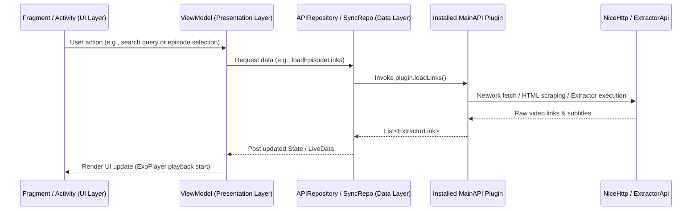

# 02. Architecture & Module Breakdown

## 1. Multi-Module Project Architecture

The CloudStream codebase is structured as a multi-module Gradle project consisting of the following modules:

```
cloudstream_ref_android/
├── settings.gradle.kts       # Gradle project settings
├── build.gradle.kts          # Top-level build configuration
├── gradle/
│   └── libs.versions.toml    # Version Catalog (centralized dependency declarations)
├── app/                      # Main Android Application module
├── library/                  # Kotlin Multiplatform (KMP) Core SDK & Plugin API module
├── shared/                   # Shared code between Android and other platforms
├── desktopApp/               # Desktop-specific implementation
└── docs/                     # Project documentation module
```

---

## 2. Module Specifications

### A. The `:library` Module (SDK & Extension API Contract)
* **Type**: Kotlin Multiplatform (KMP) library targetting `android`, `jvm`, `web`.
* **Namespace**: `com.lagradost.api`
* **Purpose**:
  * Serves as the independent SDK and contract for all extension developers.
  * Contains base abstract classes `MainAPI` and `ExtractorApi`.
  * Contains shared data models (`HomePageResponse`, `SearchResponse`, `TvSeriesSearchResponse`, `MovieSearchResponse`, `Episode`, `ExtractorLink`, `SubtitleFile`, `TvType`).
  * Houses **104 built-in `ExtractorApi` implementations** for universal video hosters (e.g., Filemoon, StreamSB, DoodStream, MixDrop, OkRu, Voe, Rabbitstream).
  * Includes network utility abstractions (`NiceHttp`, Jsoup, Ksoup, Ktor HTTP, Rhino JS engine for executing obfuscated JavaScript decryption routines).

#### KMP Source Sets in `:library`
```
library/src/
├── commonMain/         # Core API models, MainAPI, ExtractorApi, NiceHttp, Jsoup, Cryptography
├── jvmCommonMain/      # Shared JVM/Android logic, NewPipeExtractor integration, Reflect
├── androidMain/        # Android-specific extensions
├── jvmMain/            # Desktop/JVM-specific targets
├── webMain/            # Web/WASM-specific targets
└── commonTest/         # Multiplatform unit test suites
```

### B. The `:app` Module (Android Media Application Client)
* **Type**: Android Application (`com.lagradost.application`)
* **Package / Namespace**: `com.lagradost.cloudstream3`
* **Target SDK**: 37 (Android 16) | **Compile SDK**: 37 | **Min SDK**: 23 (Android 6.0)
* **Kotlin Version**: 2.4.0 | **JVM Target**: 1.8 with NIO Desugaring
* **Purpose**:
  * Hosts the entire User Interface (Fragments, ViewModels, ViewBinding, Jetpack Navigation).
  * Implements `PluginManager` for dynamic DEX loading of `.cs3`/`.zip` extensions at runtime using Android's `PathClassLoader`.
  * Manages media playback with AndroidX Media3 ExoPlayer, `nextlib` FFmpeg decoders, and `torrentserver`.
  * Handles multi-account management, DataStore persistence, local file security, background download services, and third-party tracker APIs (AniList, MAL, SIMKL, Trakt, Kitsu, OpenSubtitles).

---

## 3. Product Flavors & Build Configurations

The `:app` module configures two distinct product flavors on the `state` dimension:

| Flavor | Application ID Suffix | Versioning | Notes |
|---|---|---|---|
| `stable` | None (`com.lagradost.cloudstream3`) | Fixed `versionName` (e.g. 4.8.0) | Release production builds |
| `prerelease` | `.prerelease` (`com.lagradost.cloudstream3.prerelease`) | Timestamp-based `versionCode` + `-PRE` suffix | Nightly / Prerelease builds with dedicated signing config |

In addition, standard `debug` builds append `.debug` to the application ID.

---

## 4. Additional Modules

### C. The `:shared` Module
* **Type**: Android/KMP Library
* **Purpose**: Contains code shared between the Android app and other platform implementations (such as the desktop port). This module promotes code reuse across different targets.

### D. The `:desktopApp` Module
* **Type**: Desktop Application
* **Purpose**: Contains desktop-specific implementation that allows CloudStream to run on desktop platforms while sharing the core `:library` code. This enables the same extension ecosystem to work across Android and desktop.

### E. The `:docs` Module
* **Type**: Documentation
* **Purpose**: Contains all project documentation, including architecture descriptions, API references, and this file.

---

## 4. Architectural Patterns

CloudStream follows modern Android **MVVM (Model-View-ViewModel)** and **Unidirectional Data Flow** patterns:



### Key Architectural Layers:
1. **Presentation Layer (`com.lagradost.cloudstream3.ui.*`)**:
   * Uses Android Fragments hosted inside `MainActivity` and `CommonActivity`.
   * Jetpack Navigation component (`nav_graph.xml`) handles fragment transitions.
   * ViewBinding generates type-safe bindings for layout XML files.
2. **ViewModel Layer (`*ViewModel.kt`)**:
   * Extends Android Architecture Component `ViewModel`.
   * Utilizes Kotlin Coroutines (`viewModelScope`) and `LiveData` / `StateFlow` for state management.
3. **Repository Layer (`APIRepository.kt`, `SyncRepo.kt`, `AuthRepo.kt`)**:
   * Acts as a facade abstraction between ViewModels and background plugins/trackers.
   * Handles error recovery, parallel asynchronous fetching, and fallback mechanics.
4. **Plugin Layer (`PluginManager.kt`, `MainAPI.kt`, `BasePlugin.kt`)**:
   * Dynamically loaded Kotlin bytecode executing isolated network requests per provider.
   * Each plugin registers its `MainAPI` and `ExtractorApi` implementations with the global `APIHolder`.

---

## 5. Build System Details

### Gradle Plugins
CloudStream uses the following Gradle plugins in its top-level `build.gradle.kts`:
- `alias(libs.plugins.android.application)` - Android Application plugin
- `alias(libs.plugins.android.lint)` - Android Lint plugin
- `alias(libs.plugins.android.multiplatform.library)` - Android Multiplatform Library plugin
- `alias(libs.plugins.buildkonfig)` - Universal build configuration
- `alias(libs.plugins.dokka)` - Documentation generator
- `alias(libs.plugins.kotlin.jvm)` - Kotlin JVM plugin
- `alias(libs.plugins.kotlin.multiplatform)` - Kotlin Multiplatform plugin
- `alias(libs.plugins.kotlin.serialization)` - Kotlin Serialization plugin
- `alias(libs.plugins.compose.compiler)` - Compose Compiler plugin
- `alias(libs.plugins.compose.multiplatform)` - Compose Multiplatform plugin

### Dependency Management
All dependencies are managed through the Gradle Version Catalog (`gradle/libs.versions.toml`), which includes:
- AndroidX libraries (Activity, AppCompat, ConstraintLayout, Core KTX, etc.)
- Media3 suite (ExoPlayer, HLS, DASH, UI, Cast)
- Network libraries (NiceHttp, Jsoup, Ksoup, Ktor, OkHttp, Conscrypt)
- JSON processing (Jackson, kotlinx.serialization)
- Coroutines and other Kotlin utilities
- Third-party libraries (Coil, NewPipeExtractor, etc.)
